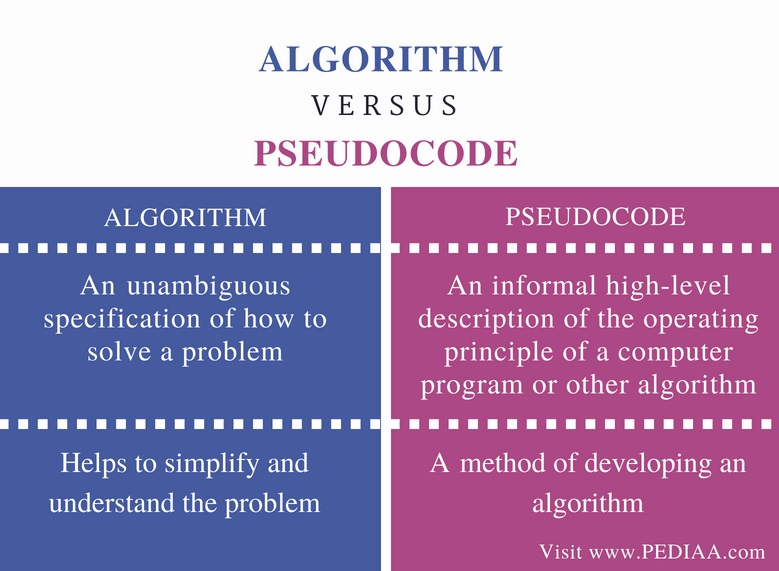
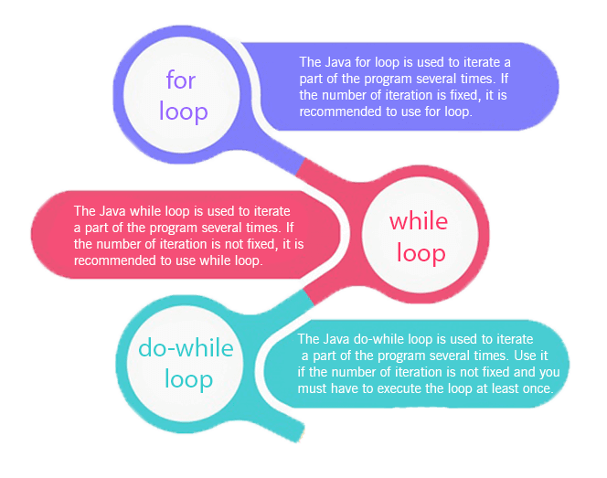
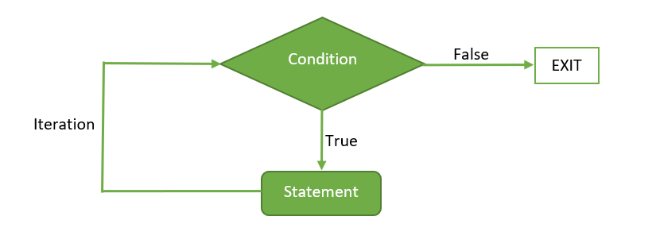

## Introduction
Some of the practical skills required of programmers include the ability to create algorithms, model problems, process data, and manage projects. Many of these same skills are also necessary for the analysis of complex or large biological data sets.

## Programming vs Coding 
Before we begin learning about how to write helpful programs for data analysis, it is important that we consider fundamental concepts and best practices in programming. While sometimes used interchangeably, [programming and coding][codingProgramming] have different definitions. 

{: width="750" }
*[Image source][codingProgramming]*

Based on your personal experiences, let's discuss our current understanding of these important concepts.

> ## Discussion
>
> What is programming?
>
>> ## Solution
>>
>> Programming is the process of creating instructions or set of related activities to achieve a task or goal.
> {: .solution}
>
> What is coding?
>
>> ## Solution
>>
>> Coding is the process of transforming the set of instructions for a process into a written language that a computer can interpret.
> {: .solution}
{: .discussion}

So although programming and coding have different meanings, they are related. The goal of coding is to create the code that acts as a set of computer instructions for a part of a programming project. The goal of programming on the other hand, is to produce programs that are complete and ready to use software products.

## Pseudocode, Code, and Algorithms... Oh My!
Although the differences seem small, there are important distinctions that we can make between the concepts of [pseudocode, code, and algorithms][algorithmPseudocode].

{: width="750" }
*[Image source][algorithmPseudocode]*

Everyone has some experienece with algorithms in their day-to-day life. For example, if you have ever cooked or done some task that requires you to follow instructions with a sequence of steps. 

> ## Discussion
>
> What are algorithms?
>
>> ## Solution
>>
>> Algorithms are the set of step-by-step instructions that explain how to solve a given problem.
> {: .solution}
{: .discussion}

Algorithms need to be represented by some form of language in order to be understood and shared with others. The process of writing pseudocode can be tremendously helpful for figuring out how to start developing code to solve a problem, or implement an algorithm.

> ## Discussion
>
> What is pseudocode?
>
>> ## Solution
>>
>> Pseudocode is the set of instructions for an algorithm written in a plain language.
> {: .solution}
{: .discussion}

As a first step before you begin developing an algorithm or writing any code, it is a good idea to write out the steps in a plain language. Let's look at an example of pseudocode for a simple algorithm to make tea:

1. Remove a teabag from the package
2. Put the teabag in a cup
3. Boil some water
4. Add the hot water to the cup
5. Allow the tea to steep for 5 minutes
6. Remove the teabag

> ## Challenge
>
> Write your own pseudocode for an algorithm to make buttered toast.
>> ## Solution
>>
>> 1. Take a slice of bread from the package
>> 2. Place the bread in the toaster
>> 3. Allow the bread to toast for 5 minutes
>> 4. Remove the toasted bread from the toaster
>> 5. Put the toasted bread on a plate
>> 6. Open the container of butter
>> 7. Grab a knife by the handle
>> 8. Dip the kife blade into the butter
>> 9. Apply the butter to the toasted side of the bread
> {: .solution}
{: .challenge}

The primary advantage to using pseudocode in your programming process is that it improves the readability of your algorithms. By first writing algorithms for programs in a plain language, it allows you to break down a complex problem into smaller and more manageable pieces for coding. Furthermore, it gives you the chance to easily identify the most complex and potentially troublesome portions for code development.

## Programming with Logic
A fundamental concept of computer programming, Boolean logic is the mathematical logic underlying Boolean algebra. In Boolean algebra mathematical expressions are evaluated to one of two values: TRUE or FALSE. Since an expression may only take on one of two values, Boolean logic is considered "two valued logic".

Note that an expression is a combination of logical operands and operators. In Boolean logic the operands are statements that can be proven true or false, and the operators are the logical AND, OR and NOT.

> ## Discussion
>
> What are some examples of boolean expressions?
>
> Hint: Use comparison operators (<, >, =, >=, <=, !=) to add complexity to your expressions!
>
>> ## Solutions
>>
>> 1. It is raining and it is Spring
>> 2. I have green eyes and I am not 4 feet tall
>> 3. My cat is hungry or my cat is cute
>> 4. The temperature is < 32 degrees Fahrenheit and it is snowing 
> {: .solution}
{: .discussion}

We can combine boolean expressions with basic control statements to set how programs will complete a task. Control statments allow you to make have flexible outcomes by selecting which section of codes are executed. 

The three primary types of [control statements][controlStructures] are: 
- Sequential statmenetes are executed in the default ordering
- Iterative statements control the number of times a block of code is executed
- Conditional (or selection) statements control which blocks of code are executed, and which are not

{: width="750" }
*[Image source][controlStructures]*

The most common [iterative statements][loopStatements] are defined using either FOR or WHILE loops.

{: width="750" }
*[Image source][loopStatements]*

> ## Challenge
>
> What does the following FOR loop output?
>
> **Pseudocode:**
> 1. For each x in the sequence 1, 2, 3, 4, 5 
> - print the value of x
>
> {: width="750" }
> *[Image source][loopsInR]*
>
>> ## Code Examples
>> ~~~
>> for (x in 1:5) {
>>   print(x)
>> }
>> ~~~
>> {: .language-r}
>>
>> ~~~
>> for x in {1..5}
>> do
>>   echo $x
>> done
>> ~~~
>> {: .language-bash}
> {: .callout}
>
>> ## Solution
>>
>> The FOR loop outputs the current value of x at each iteration:
>> ~~~
>> 1
>> 2
>> 3
>> 4
>> 5
>> ~~~
>> {: .output}
> {: .solution}
{: .challenge}

> ## Challenge
>
> What does the following WHILE loop output?
>
> **Pseudocode:**
> 1. Set x equal to 1
> 2. While x is less than 3 
> - print the value of x
> - increment the value of x by 1
>
> {: width="750" }
> *[Image source][loopsInR]*
>
>> ## Code Examples
>> ~~~
>> x <- 1
>> while (x < 3) {
>>   print(x)
>>   x <- i + 1
>> }
>> ~~~
>> {: .language-r}
>>
>> ~~~
>> x=1
>> while [ $x -lt 3 ]
>> do
>>   echo $x
>> done
>> ~~~
>> {: .language-bash}
> {: .callout}
>
>> ## Solution
>>
>> The WHILE loop outputs the current value of x at each iteration:
>> ~~~
>> 1
>> 2
>> 3
>> ~~~
>> {: .output}
> {: .solution}
{: .challenge}

The most common [conditional statements][conditionalStatements] are defined using combinations of the IF... THEN... ELSE format.

{: width="750" }
*[Image source][conditionalStatements]*

The most simple form of conditional statement is the IF... THEN form.

> ## Challenge
>
> What does the following IF... THEN conditional statement output?
>
> **Pseudocode:**
> 1. Set x equal to 3
> 2. If x is greater than 6, then print the value of x
>
> {: width="750" }
> *[Image source][ifThenInPython]*
>
>> ## Code Examples
>> ~~~
>> x <- 7
>> if (x > 6) {
>>   print(x)
>> }
>> ~~~
>> {: .language-r}
>>
>> ~~~
>> x=7
>> if [ $x -gt 6 ]
>> then
>>   echo $x
>> fi
>> ~~~
>> {: .language-bash}
> {: .callout}
>
>> ## Solution
>>
>> The IF... THEN statement outputs the value of x if it is greater than 6:
>> ~~~
>> 7
>> ~~~
>> {: .output}
> {: .solution}
{: .challenge}

The next type of conditional statement adds a level of complexity with the IF... THEN... ELSE format.

> ## Challenge
>
> What does the following IF... THEN... ELSE conditional statement output?
>
> **Pseudocode:**
> 1. Set x equal to 7
> 2. If x is less than 6, then print the value of x
> 3. Else print "x is greater than or equal to 6"
>
> {: width="750" }
> *[Image source][ifElseInR]*
>
>> ## Code Examples
>> ~~~
>> x <- 7
>> if (x < 6) {
>>   print(x)
>> } else {
>> 	print("x is greater than or equal to 6")
>> }
>> ~~~
>> {: .language-r}
>>
>> ~~~
>> x=7
>> if [ $x -lt 6 ]
>> then
>>   echo $x
>> else
>>   echo "x is greater than or equal to 6"
>> fi
>> ~~~
>> {: .language-bash}
> {: .callout}
>
>> ## Solution
>>
>> The IF... THEN... ELSE statement outputs the value of x if it is less than 6, else it prints a message:
>> ~~~
>> x is greater than or equal to 6
>> ~~~
>> {: .output}
> {: .solution}
{: .challenge}

The final version of the conditional statement that we will consider further combines the IF... THEN... ELSE tags to make a statememnt with many alternative outcomes.

> ## Challenge
>
> What does the following multiple IF... THEN... ELSE conditional statement output?
>
> **Pseudocode:**
> 1. Set x equal to 7
> 2. If x is equal to 6, then print "x is equal to 6"
> 3. Else if x is greater than 6, then print "x is greater than 6"
> 4. Else if x is less than 6, then print "x is less than 6"
>
> {: width="750" }
> *[Image source][ifElseInR]*
>
>> ## Code Examples
>> ~~~
>> x <- 7
>> if (x = 6) {
>>   print("x is equal to 6")
>> } else if (x > 6) {
>> 	print("x is greater than 6")
>> } else if (x < 6) {
>> 	print("x is less than 6")
>> }
>> ~~~
>> {: .language-r}
>>
>> ~~~
>> x=7
>> if [ $x -eq 6 ]
>> then
>>   echo "x is equal to 6"
>> elif [ $x -gt 6 ]
>> then
>>   echo "x is greater than 6"
>> elif [ $x -lt 6 ]
>> then
>>   echo "x is less than 6"
>> fi
>> ~~~
>> {: .language-bash}
> {: .callout}
>
>> ## Solution
>>
>> The IF... THEN... ELSE statement outputs a message depending on if the value of x is equal to, greater than, or less than 6:
>> ~~~
>> x is greater than 6
>> ~~~
>> {: .output}
> {: .solution}
{: .challenge}

> ## Additional Challenge
> 
> If you are looking for an additional challenge, consider the following nested IF... THEN... ELSE statement:
>
> **Pseudocode:**
> 1. Set x equal to 4
> 2. If x is greater than 4, then check if x is equal to 6
> - If x is equal to 6, then print "x is equal to 6"
> - Else print "x is greater than 4"
> 3. Else print "x is less than or equal to 4"
>
> {: width="750" }
> *[Image source][nestedIfElseInR]*
>
>> ## Code Examples
>> ~~~
>> x <- 4
>> if (x > 4) {
>>   if (x = 6) {
>> 	   print("x is equal to 6")
>> 	 } else {
>> 	   print("x is greater than 4")
>> } else {
>>   print("x is less than or equal to 4")
>> }
>> ~~~
>> {: .language-r}
>>
>> ~~~
>> x=4
>> if [ $x -gt 4 ]
>> then
>>   if [ $x -eq 6 ]
>>   then
>>     echo "x is greater than 4"
>>   else
>>     echo "x is less than or equal to 4"
>>   fi
>> fi
>> ~~~
>> {: .language-bash}
> {: .callout}
>
>> ## Solution
>>
>> The nested IF... THEN... ELSE statement outputs the following message:
>> ~~~
>> x is less than or equal to 4
>> ~~~
>> {: .output}
> {: .solution}
{: .challenge}

[codingProgramming]: https://techbiason.com/coding-vs-programming/
[algorithmPseudocode]: https://pediaa.com/difference-between-algorithm-and-pseudocode/
[controlStructures]: https://docs.oracle.com/cd/B19306_01/appdev.102/b14261/controlstructures.htm
[loopStatements]: https://www.javatpoint.com/java-for-loop
[loopsInR]: https://www.geeksforgeeks.org/loops-in-r-for-while-repeat/
[conditionalStatements]: https://code.org/curriculum/course2/12/Teacher
[ifThenInPython]: https://innovationyourself.com/conditional-statements-in-python/
[ifElseInR]: https://www.datasciencemadesimple.com/if-else-condition-r/
[nestedIfElseInR]: https://www.tutorialgateway.org/nested-if-else-in-r/



