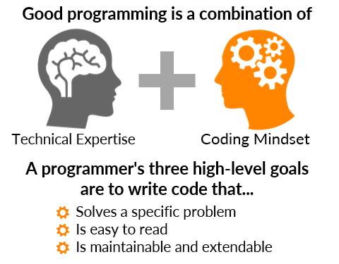

## Introduction
In this section we will learn about some of the common best practices in programming, which are easy to implememnt into your programming process. We will also explore approaches to solving problems and where to begin with designing algorithms.

## How to Be a Good Programmer
The development of custom software programs has become increasingly necessary in biological research. Scientists are often required to create their own programs to analyze data and create publishable results. It is therefore very important that we consider [techniques for improving][goodProgrammer] the reproducibility and reliability of code. 

{: width="500" }
*[Image source][goodProgrammer]*

There are several things to keep in mind while working through your programming process. These are techniques that will help you to solve complex problems, while avoiding common pitfalls.

> ## Checklist
>
> These are programming techniques that have been found to be helpful in a variety of research settings.
> - Use programs to accomplish complex or repetative tasks
> - Write programs that can be understood by others
> - Take the time to plan how you will write a program
> - Make small changes and plan for mistakes
> - Collaborate with others whenever possible
> - Always include informative documents for your programs and data
> - Carefully structure and track your raw and calculated data
{: .checklist}

By implementing the above programming techniques, you will be better prepared to create sets of code to analyze complex biological data sets. 

## Ways to Approach Programming Tasks
Throughout any programming undertaking we should be thinking about our problem solving thought process. This means that you will need to think critically about how you approach [solving coding problems][codingProblems] with programming. Often you will find that there are many routes to the same solution, and which route you take may depend on your intended user or available tools.

{: width="800" }
*[Image source][codingProblems]*

> ## Checklist
>
> These are steps you can take to approach solving a problem.
> 1. Understand the problem
> 2. Create a plan to solve the problem
> 3. Implement the plan
> 4. Reflect on the results
{: .checklist}

The first step for approaching problem solving requires us to break down the problem before we can begin creating a solution plan. 

> ## Checklist
>
> There are a few techniques we can use to help break down a problem before coding.
> 1. Determine the inputs
> 2. Determine the outputs
> 3. Test a simple example
> 4. Test a complex example
{: .checklist}

Now, let's put these steps into practice. Keep in mind that the number of steps a task or problem is broken into may depend on the skills of the intended user or available tools.

> ## Challenge
>
> Write an algorithm in pseudocode to complete the task of getting dressed for the day, while considering the:
> - Current weather
> - Clothes available to you
>
> To keep things simple, assume that:
> - You are currently wearing pajamas
> - You will wear only one top and one bottom clothing item
> - You will be outside all day
> - The weather will not change
> 
>> ## Solution
>>
>> In order to determine how to write an algorithm for getting dressed for the day, we should consider the following steps to breaking down a problem.
>>
>> **First,** determine the inputs
>> 1. Current weather
>> 2. Available clothing
>>
>> **Second,** determine the outputs
>> 1. The clothes that you will be wearing for the day
>> 2. The order in which the clothing should be put on
>>
>> **Third,** test a simple example by specifying sample inputs:
>> 1. The weather outside is cold
>> 2. You have access to a pair of pants and a shirt
>>
>> *Our simple algorithm might then be:*
>> 1. Walk to where your clothes are kept
>> 2. Take off pajamas
>> 3. Take out the the pants and shirt
>> 4. Put on pants
>> 5. Put on shirt
>>
>> **Fourth,** test a complex example
>> Let's try out a more complex example by generalizing the inputs:
>> 1. Assume you have a way to check the current weather
>> 2. Assume you have a closet with all types of clothing
>>
>> *Our more complex algorithm might then be:*
>> 1. Check the weather
>> 2. Walk to wear you clothes are kept
>> 3. If the temperature is less than 75 degrees fahrenheit, then
>> - Put on pants
>> - Put on shirt
>> 4. If the temperature is greater than 75 degrees fahrenheit, then
>> - Put on shorts
>> - Put on tank top
>>
>> Note that one way to generalize your algorithm is to use conditional statements, such as the "if" statements in the above example algorithm. Remember that conditonal statements are used in programming to handle descisions, and they have two parts: hypothesis (if) and conclusion (then). So, the outcome of a conditional statement depends on the state of the inputs at that moment.
> {: .solution}
{: .challenge}

After devising a plan for a solution to a problem or task, it is a good idea to stop and think carefully about the plan. This is particularly important for debugging and fixing any errors. 

> ## Checklist
>
> Some questions you can ask yourself at this point include:
> - Is my solution comprehensive?
> - Did I make any mistakes?
> - How can errors or incorrect outputs arise?
> - What can I do next?
{: .checklist}

Considering our simple solution to the previous challenge of writing an algorithm for getting dressed, there remain other ways that the algorithm may be written to be more comprehensive. For example, what if the intended user or audience is a young child? Then it may be necessary to further break down the steps of the algorithm to meet the needs of the user.

> ## Challenge
>
> For example, let's re-write step 4 of the simple algorithm from our solution to the above challenge. Try to break down this part of the task into as many steps as possible.
>
>> ## Solution
>>
>> Instead of leaving the step to "Put on pants", we might break down the step as follows:
>> 1. Hold pants
>> 2. Open waistband
>> 3. Insert right leg into right leg hole of pants
>> 4. Insert left leg into left leg hole of pants
>> 5. Pull left pant leg up so the left foot comes through it
>> 6. Pull pants up from waitsband
> {: .solution}
{: .challenge}

## Commenting & Helpful Services

Small [meaningful comments][meaningfulComments] throughout your code can be a great way to leave yourself and others helpful notes about the purpose of your code. This is particularly important when approaching a new coding challenge, or when you need to take break. It is also helpful to leave frequent comments for code in programming languages you do not freuqently write in.

{: width="500" }
*[Image source][meaningfulComments]*

> ## Checklist
>
> A general rule of thumb when coding is to have comments at least every 5 lines. Some other tips to keep in mind include when coding in R:
> - Preferably write code while you are coding, and not after
> - Each line of a comment should begin with the comment symbol **#** and a single space
> - Comments should explain the why and not the what, unless helpful for your future self
> - Use commented lines of multiple - and = to break up your file into easily readable chunks
{: .checklist}

Creating comments for your code is most useful when you are describing *why* it does what it does. This gives your code context, which gives other developers (or your future self) more insights into the design decisions behind a piece of code.

Looking at the documentation is one of the best ways to find out or recall exactly *what* a piece of code is doing. Another great way to learn the meaning of different pieces of code is through a community website where people can ask coding questions using specific examples (e.g., [StackOverflow][SO], and [Biostars][BS]). There are also many, many wonderful websites and blogs with posts covering nearly any topic of which you could think (e.g., [codecademy][codecademy], [tutorials point][TP][R-bloggers][RB], [R Weekly][RW], and my own site [Myscape][Myscape]).

### A Note on Documentation

Writing comprehensive documentation about your code is a great way to convey important information about your software program. and give your code further context. A common form of documentation is a [**README**][docStrats] file in the directory of your code. This document is a description of the what, why, and how of the project for which the code was written.

{: width="800" }
*[Image source][readmeDocs]*

> ## Checklist
> To help motivate writting documentation for your code, here are some questions you can ask yourself.
> - What was your motivation?
> - Why did you build this project?
> - What problem does it solve?
> - What did you learn?
> - What makes your project stand out?
{: .checklist}

[codingProblems]: https://www.geeksforgeeks.org/how-to-approach-a-coding-problem/ 
[goodProgrammer]: https://mitcommlab.mit.edu/broad/commkit/coding-mindset/
[meaningfulComments]: https://www.stepsize.com/blog/the-engineers-guide-to-writing-code-comments
[codecademy]: https://www.codecademy.com/catalog/language/r?g_network=g&g_device=c&g_adid=494035656878&g_keyword=&g_acctid=243-039-7011&g_adtype=search&g_adgroupid=122166635692&g_keywordid=dsa-1147291854134&g_campaignid=12144922488&g_campaign=US+DSA+-+Catalog&utm_id=t_dsa-1147291854134:ag_122166635692:cp_12144922488:n_g:d_c&utm_term=&utm_campaign=US%20DSA%3A%20Catalog&utm_source=google&utm_medium=paid-search&utm_content=494035656878&hsa_acc=2430397011&hsa_cam=12144922488&hsa_grp=122166635692&hsa_ad=494035656878&hsa_src=g&hsa_tgt=dsa-1147291854134&hsa_kw=&hsa_mt=&hsa_net=adwords&hsa_ver=3&gclid=Cj0KCQiAxoiQBhCRARIsAPsvo-w6GRi0Zpoyejk9YrXjYxjAD_FUNVF9WQ21g5HTA7pNGY72U7ng7B8aAtjoEALw_wcB
[TP]: https://www.tutorialspoint.com/r/index.htm
[SO]: https://stackoverflow.com/
[BS]: https://www.biostars.org/
[RB]: https://www.r-bloggers.com/
[RW]: https://rweekly.org/
[Myscape]: https://morphoscape.wordpress.com/category/tech/
[readmeDocs]: https://blog.submain.com/code-documentation-the-complete-beginners-guide/
[docStrats]: https://www.freecodecamp.org/news/how-to-write-a-good-readme-file/


