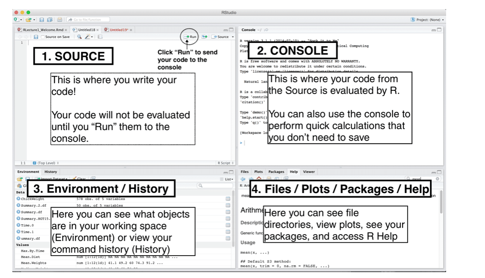
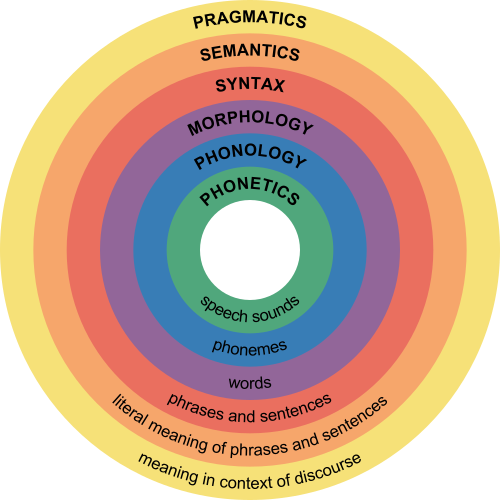
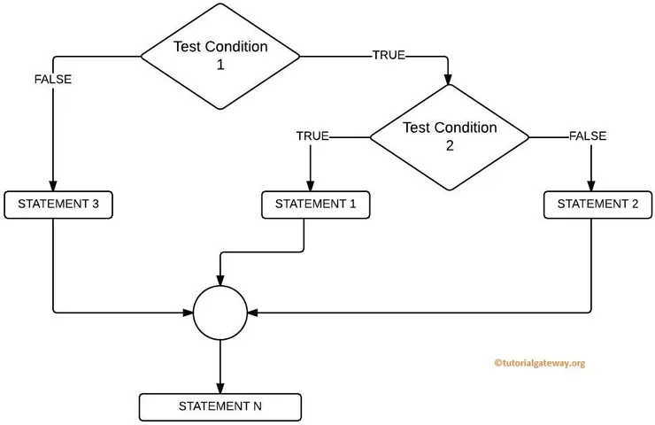

## The R Programming Language

The R programming language is a great first language for anyone interested in using coding to help answer questions with data analysis, data visualization, and data science. R provides a wide variety of tools for statistical and graphical techniques, including; linear and nonlinear modelling, classical statistical tests, time-series analysis, classification, clustering, and more. A strength of the R language is the ease with which publication-quality plots can be generated, including mathematical symbols and formulae.

{: width="800" }
*[Image source][rMotivation]*

Since the R programming language is [open source][openSource] it is not proprietary, and it can be modified and built upon by the public. Furthermore, [R][rLang] environment itself is an integrated suite of software for data manipulation, calculation, and graphics. The flexible R environment includes:
- effective data handling and storage facility
- operators for calculations on arrays, and matrices in particular
- collections of intermediate tools for data analysis
- graphical facilities for data analysis and display
- well-developed, simple and effective programming language that includes:
  - conditionals
  - loops
  - user-defined recursive functions
  - input and output capabilities

### The Utility and Components of RStudio

RStudio is a very useful software program that allows you to work with the R programming language using a convienient user interface (UI). The interface for RStudio has four main components: source, console, environment/history, files/plots/packages/help.

{: width="800" }
*[Image source][componentsRStudio]*

The most important component of RStudio is the **console**, which is essentially the heart of RStudio. It is from here that you can run code, and it is here that R actually evaluates code.

Another place you can enter and run code is from the **source** component of RStudio. This is where you can write and edit code to save in a file, or scripts. Note that R script files have **.R** or **.r** as their file extension. 

## R Programming Language Syntax

The [syntax of a programming language][rSyntax] defines the meaning of specific combinations of words and symbols. This is why we call programming coding. Each programming language uses different combinations of words and symbols to get the computer to follow the instructions specified in your code. 

{: width="500" }
*[Image source][whatIsSyntax]*

### Variables & Data Types

In the R programming language a combination of letters and symbols are used to give names to the data you are actively using in the memory of your computer system. These names are called [variables][rVars]. Variables are named storage that your programs can access and manipulate. These variables may be storing the values you specify directly in your code, or data stored in other files.

To set (assign) the value of a variable means that it is referring (pointing) to a specific value or piece of data in the memory of the computer system that is running (executing) your code. 

~~~
# here is an integer value
4

# here is a variable with an assigned integer value of 4
my_value <- 4
~~~
{: .language-r}

In general, the R programming language may be considered a more complicated and capable calculator. Let's start learning to code in R by using the following common arethmatic operation symbols, or operators:
- addition **+**
- subtraction **-**
- division **/**
- exponentiation **^ or \*\***

To get you started, the following is an example of R code that adds two values of 8 with the addition operator in a few of different ways.
~~~
# addition using the values directly
8 + 8

# addition using the values stored in a variable
my_value <- 8
my_value + my_value

# addition using two different variables with the different assigned values
# and the result is stored in the variable named my_result
my_value_1 <- 4
my_value_2 <- 8
my_result <- my_value_1 + my_value_2
~~~
{: .language-r}

> ## Tip!
>
> Note that the value of 8 was just stored in the **my_value** variable, which we used earlier to store a value of 4. It is possible to overwrite the data pointed to by a variable by assigning with the **<-** operator a new value to the same variable name. This essentially removes from active memory the previous data value that was stored using that variable name.
{: .callout}

The type of data that is being stored and referred to by variables often needs to be specified. One reason for this is because some mathematical or computational operations cannot be performed on different data types.

{: width="800" }
*[Image source][rVarsTypes]*

> ## Coding Challenge
>
> What are some more code examples of variables that have different data types?
> 
>> ## Solution
>> 
>> ~~~
>> # variable with a character value 
>> my_chars <- "hello"
>> 
>> # variable with a numeric value
>> my_nums <- 0.5
>>
>> # variable with the result of two numeric values being added together (evaluated)
>> my_add_result <- 0.5 + 1.7
>> 
>> # variable with a value assigned from the data in the my_file.txt text file
>> my_file_data <- read.delim("my_file.txt")
>> ~~~ 
>> {: .language-r}
> {: .solution}
{: .challenge}

### R Functions - Printing, Vectors, Matrices, and Data Frames

Functions in R are used to  The syntax of a function in R defines a block of code (statements) that can be used repeatedly and on demand (call) in a program.

{: width="800" }
*[Image source][rFuncSyntax]*

Perhaps the most fundamental function in any programming language is one that allows you to print data to the screen. This allows you to view the values assigned to variables and identify the source of problems in you code, for example.

> ## Tip!
>
> The quickest and easiest way to find out more information about a R function, including what it is and how to use it, is with the **?** symbol in RStudio.
>
> ~~~
> # examine the documentation for the print function in R
> ?print
> ~~~
> {: .language-r}
{: .callout}

The most common function to print outputs in R is named **print**. This function requires as input a R object, such as a character string or variable.

~~~
# print a character object to the screen
print("Coding is fun!")

# print a variable to the screen
my_var <- "Coding is fun!"
print(my_var)
~~~
{: .language-r}

*Vectors*, *matrices*, and *data frames* are called R objects. Objects are a concept fundamental to [object oriented programming][OOP], and each obejct has specific attributes and behaviors. In the R programming language these are named storage that contains 1D and 2D collections of data. 

Each piece of data in a vector can be accessed by specifying the index of the piece of data, or element. The data in vectors must all be of the same data type. Furthermore, vectors can be assigned to variables in R.

To create 1D vector storages we can use built in R functions. For example, we can create a vector of numbers representing the sequence of values as follows.

~~~
# 1D vector using the : binary operator
1:10

# 1D vector in the reverse order
10:1

# examine the documentation for the seq function in R
?seq

# 1D vector using the seq function and explicit arguments
seq(from = 1, to = 10)

# 1D vector using the seq function and implicit arguments
seq(1, 10)

# print a 1D vector to the screen using the print and seq functions together
print(seq(1,10))

# variable with an assigned value of a 1D vector object
my_vector <- seq(1, 10)

# view the data contents of myVector using the print function
print(my_vector)

# short hand way to view the data contents of myVector
my_vector

# access the second element of the vector stored in myVector
my_vector[2]
~~~
{: .language-r}

> ## Tip!
>
> Note that we were able to use (call) a **print** function using a **seq** function contained (nested) inside the arguments of the **print** function. Nested function calls allow you to perform multiple tasks using fewer lines of code, for example.
{: .callout}

> ## Coding Challenge
> 
> How would you print both a character object and a variable to the screen?
>
> **Hint:** Use the internet to search "r print string and variable", for example.
>
>> ## Solution
>> 
>> ~~~
>> # store a integer value in a variable
>> my_var <- 20
>> 
>> # print the value stored both the variable and character object
>> # to the console using the cat function
>> cat("The value of my_var is", my_var)
>> ~~~
>> {: .language-r}
> {: .solution}
{: .challenge}

We can also create a 1D list using the **list** function in R. These are R objects that can contain data elements of different types. What's more, the data in lists can be variables, 1D, and 2D R objects.

~~~
# list of values with different data types
my_list <- list(1:4, TRUE, 0.5, "meow")

# view the contents of the list variable
print(my_list)
~~~
{: .language-r}

Next, we can use different R functions to create a 2D data frame and a 2D matrix that each contain multiple sets of sequences. Matrices are objects in which the elements are arranged in a 2D rectangular layout, and data frames are 2D tables in which each column contains values of one variable and each row contains one set of values from each column. Additionally, we can access different pieces of data (elements) stored in our matrix by using the column and row index of the element.

~~~
# examine the documentation for the matrix function in R
?matrix

# 2D matrix where the sequence data is filled in by row
# and the data specified using a nested seq function call
matrix(data = seq(1, 10), nrow = 2, byrow = TRUE)

# 2D matrix where the sequence data is filled in by column 
# with the default byrow argument value of FALSE and implicit data argument
matrix(seq(1, 10), nrow = 2)

# variable storing 1D sequence data
my_vector <- seq(1, 10)

# 2D matrix where the sequence data is added (passed) to the matrix function using a variable
matrix(my_vector, nrow = 2)

# variable storing 2D matrix where the data argument is passed using a variable
my_mat <- matrix(my_vector, nrow = 2)

# view the contents of my_mat
my_mat

# access the first element of the second column using the column and row index of the element
my_mat[1,2]
~~~
{: .language-r}

> ## Coding Challenge
>
> How would you access a specific element of a matrix that is not stored in memory using a variable?
>
>> ## Solution
>>
>> ~~~
>> # access the first element of the second column in a matrix not stored in memory while it is created
>> matrix(seq(1, 10), nrow = 2)[1,2]
>> ~~~
>> {: .language-r}
> {: .solution}
{: .challenge}

Similar to using the **matrix** function, we can use the **data.frame** function to create 2D data tables. Remember that these are simply a collection of vectors that all have the same (equal) length. An interesting difference between data frames and matrices is that data frames can be a collection of vectors each with different data types, but matrices require all the row and column vectors of data to be the same type.

~~~
# examine the documentation for the c function in R
?c

# variable with a 1D vector of character data to be used as our first column
char_var <- c("coding in", "R", "is fun", ":)") 

# variable with a 1D vector of integer data to be used as our first column
seq_var <- seq(1, 4) 

# examine the documentation for the data.frame function in R
?data.frame

# variable with a 2D data frame storing our three 1D vectors using implicit column naming
df <- data.frame(char_Var, seq_var)

# 2D data frame storing our three 1D vectors using explicit column naming
data.frame(characters = char_var, integers = seq_var)
~~~
{: .language-r}

As we have seen, it is often useful to think of the 2D storage of values in data frames and matrices as a combination of 1D storages. We use the **[]** operator to select not only a single element of a 1D or 2D data collection, but also to break down a 2D matrix or data frame and retrieve specific vectors or other data subsets.

~~~
# take a look at the letters function
?letters

# variable with a 4x2 matrix of sequential letters starting with a
my_mat <- matrix(letters[1:8], ncol = 2)

# retrieve the first element of my_mat
my_mat[1, 1]

# retrieve the entire third row of my_mat
my_mat[3,]

# retrieve the entire second column of my_mat
my_mat[,2]

# retrieve the subset of my_mat that is the second (bottom) half
my_mat[3:4, 1:2]

# variable with a 4x4 data frame
my_DF <- data.frame(
	chars = letters[1:4], 
	ints = 1:4, 
	logics = c(TRUE, FALSE, TRUE, TRUE), 
	nums = seq(from = 0.1, to = 1, length.out = 4)
)

# retrieve the first half of myDF
my_DF[1:2, 1:2]

# retrieve the second column using indexing
my_DF[,2]

# retrieve the second column using the $ operator and column name
my_DF$ints
~~~
{: .language-r}

> ## Tip!
>
> If a line of code becomes too long and shifts (wraps around) to the next line, it is a good idea to break it into appropriate code pieces on separate lines. For example, in the previous **my_DF** function call we wrote each argument on a separate line.
{: .callout}

> ## Coding Challenge
> 
> How are the values for in the sequence of decimals in the following **seq** function call calculated?
> ~~~
> seq(from = 0.1, to = 1, length.out = 4)
> ~~~
> {: .language-r}
> 
>> ## Solution
>>
>> From looking at the documentation for seq using the **?** operator:
>> ~~~
>> ## Default S3 method:
>> seq(from = 1, to = 1, by = ((to - from)/(length.out - 1)),
>>    length.out = NULL, along.with = NULL, ...)
>> ~~~
>> {: .language-r}
> {: .solution}
{: .challenge}

## Logic & Control Statements in R

Recall that we can combine boolean expressions with control statements to specify how programs will complete a task. Control statments allow you to have flexible outcomes by selecting which pieces of codes are executed, or not. 

The three primary types of [control statements][controlStructures] are: 
- Sequential statmenetes are executed in the default ordering
- Iterative statements control the number of times a block of code is executed
- Conditional (or selection) statements control which blocks of code are executed, and which are not

The most common control structure of [sequential statements][seqStatements] are lines of code written one after another, and executed line by line.

> ## Coding Challenge - Sequential Statements
>
> Write R code for the following sequential statments:
>
> **Pseudocode**
> 1. Assign x the character value of "hello" 
> 2. Print the value of x
> 
>> ## Solution
>>
>> **R Code**
>> ~~~
>> x <- "hello"
>> print(x)
>> ~~~
>> {: .language-r}
>>
>> ~~~
>> [1] "hello"
>> ~~~
>> {: .output}
> {: .solution}
{: .challenge}

Iterative statements allow you to execute the same piece of code a specified number of times, or until a condition is reached. The most common [iterative statements][loopStatements] are defined using either FOR or WHILE loops.

> ## Coding Challenge - Iterative Statements Part 1
>
> Write R code for the following FOR loop output:
>
> **Pseudocode**
> 1. For each value in the sequence a, b, c, d 
> - Assign x the current value
> - print the value of x
>
>> ## Solution
>>
>> **R Code**
>> ~~~
>> for (x in letters[1:4]) {
>>   print(x)
>> }
>> ~~~
>> {: .language-r}
>>
>> ~~~
>> [1] "a"
>> [1] "b"
>> [1] "c"
>> [1] "d"
>> ~~~
>> {: .output}
> {: .solution}
{: .challenge}

WHILE loops are another type of iterative statement that can be used as a control structure in your code. This type of iterative statement will continue to execute a piece of code until a condition is reached.

> ## Coding Challenge - Iterative Statements Part 2
>
> Write R code for the following WHILE loop output:
>
> **Pseudocode**
> 1. Assign x the value of 3
> 2. While x is greater than 0 
> - print the value of x
> - increment the value of x by 1
>
>> ## Solution
>>
>> **R Code**
>> ~~~
>> x <- 3
>> while (x > 0) {
>>   print(x)
>>   x <- x - 1
>> }
>> ~~~
>> {: .language-r}
>>
>> ~~~
>> [1] 3
>> [1] 2
>> [1] 1
>> ~~~
>> {: .output}
> {: .solution}
{: .challenge}

The most common [conditional statements][conditionalStatements] are defined using combinations of the IF... THEN format.

The most simple form of conditional statement is the IF... THEN form.

> ## Coding Challenge - Conditional Statements Part 1
>
> Write R code for the following IF... THEN conditional statement output:
>
> **Pseudocode**
> 1. Assign x the value of "a"
> 2. If x is equal to "a", then print the value of x
>
>> ## Solution
>>
>> **R Code**
>> ~~~
>> x <- "a"
>> if (x == "a") {
>>   print(x)
>> }
>> ~~~
>> {: .language-r}
>>
>> ~~~
>> [1] "a"
>> ~~~
>> {: .output}
> {: .solution}
{: .challenge}

The next type of conditional statement adds another level of complexity with the IF... THEN... ELSE format.

> ## Coding Challenge - Conditional Statements Part 2
>
> Write R code for the following IF... THEN... ELSE conditional statement output:
>
> **Pseudocode**
> 1. Assign x the value of "b"
> 2. If x is equal to "a", then print the value of x
> 3. Else print "x is not equal to the character 'a'"
>
>> ## Solution
>>
>> **R Code**
>> ~~~
>> x <- "b"
>> if (x == "a") {
>>   print(x)
>> } else {
>> 	print("x is not equal to the character 'a'")
>> }
>> ~~~
>> {: .language-r}
>>
>> ~~~
>> "x is not equal to the character 'a'"
>> ~~~
>> {: .output}
> {: .solution}
{: .challenge}

A more advanced type of conditional statement combines multiple IF... THEN... ELSE statements to make a compound statememnt with many alternative outcomes.

> ## Coding Challenge - Conditional Statements Part 3
>
> Write R code for the following compound IF... THEN... ELSE conditional statement output:
>
> **Pseudocode**
> 1. Assign x the value of "c"
> 2. If x is equal to "a", then print "x is equal to 'a'"
> 3. Else if x is not equal to "c", then print "x is not equal to 'a' or 'c'"
> 4. Else if x is equal to "c", then print "x is equal to 'c'"
>
>> ## Solution
>>
>> **R Code**
>> ~~~
>> x <- 'c'
>> if (x == 'a') {
>>   print("x is equal to 'a'")
>> } else if (x != 'c') {
>> 	print("x is not equal to 'a' or 'c'")
>> } else if (x == 'c') {
>> 	print("x is equal to 'c'")
>> }
>> ~~~
>> {: .language-r}
>>
>> ~~~
>> "x is equal to 'c'"
>> ~~~
>> {: .output}
> {: .solution}
{: .challenge}

### Advanced Concept

An even more advanced concept, [nested IF... THEN... ELSE][nestedIfElseInR] statements can increase the flexability of your code by allowing you to specify more complex conditions.

{: width="800" }
*[Image source][ifElseInR]*

> ## Advanced Coding Challenge
> 
> If you are looking for an additional challenge, write R code for the following nested IF... THEN... ELSE statement:
>
> **Pseudocode**
> 1. Assign x the value of 8
> 2. If x is less than 1, then check if x is equal to 'c'
> - If x is equal to 6, then print "x is equal to 6"
> - Else print "x is greater than 4"
> 3. Else print "x is less than or equal to 4"
>
>> ## Solution
>>
>> **R Code**
>> ~~~
>> x <- 8
>> if (x < 1) {
>>   if (x == 'c') {
>>     print("x is less than 1 and equal to 'c")
>>   } else {
>>     print("x is less than 1")
>>   }
>> } else {
>>   print("x is greater than 1")
>> }
>> ~~~
>> {: .language-r}
>>
>> ~~~
>> "x is greater than 1"
>> ~~~
>> {: .output}
> {: .solution}
{: .challenge}

[whatIsSyntax]: http://www.differencebetween.net/language/difference-between-morphology-and-syntax/
[rFuncSyntax]: https://www.learnbyexample.org/r-functions/
[rSyntax]: https://cs.lmu.edu/~ray/notes/syntax/
[rLang]: https://www.r-project.org/about.html
[componentsRStudio]: https://datascienceplus.com/introduction-to-rstudio/ 
[rMotivation]: https://data-flair.training/blogs/why-learn-r/
[openSource]: https://www.techopedia.com/definition/25149/open-source-language
[OOP]: https://www.datacamp.com/community/tutorials/r-objects-and-classes
[rVars]: https://www.tutorialspoint.com/r/r_variables.htm
[rVarsTypes]: https://sydney-informatics-hub.github.io/lessonbmc/02-BMC_R_Day1_B/index.html
[controlStructures]: https://docs.oracle.com/cd/B19306_01/appdev.102/b14261/controlstructures.htm
[seqStatements]: http://status-twitter.blogspot.com/2013/11/uses-of-sequential-and-compound.html
[loopStatements]: https://www.javatpoint.com/java-for-loop
[loopsInR]: https://www.geeksforgeeks.org/loops-in-r-for-while-repeat/
[ifThenInPython]: https://innovationyourself.com/conditional-statements-in-python/
[ifElseInR]: https://www.datasciencemadesimple.com/if-else-condition-r/
[nestedIfElseInR]: https://www.tutorialgateway.org/nested-if-else-in-r/


