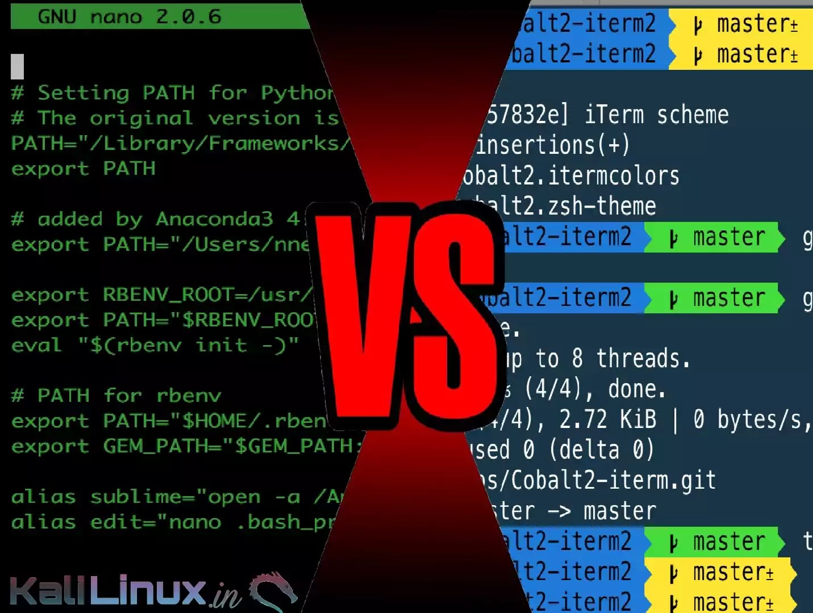
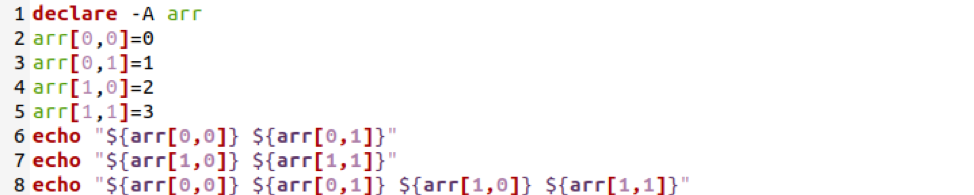

## The BASH Programming Language

The [BASH command language][commandLangBASH] (Bourne Again SHell) is a programming language that is sh-compatible. This means that it is a programming language through which a user communicates with the operating system or a software program (application).

BASH is the default *shell* on most Linux operating system installations, and its wide distribution with [Linux and Unix][linuxUnix] systems makes it an important tool to know.

{: width="500" }
*[Image source][programmingBASH]*

The BASH language is used to communicate with the interpreter component of a computer system. The interpreter executes program code commands read from the standard input (e.g., terminal) or from a file. BASH script files end with the **.sh** extension, in contrast to the **.R** or **.r** extension of R scripts.

### The Utility and Components of BASH

To many beginning programmers it can seem like BASH is a big black box, which can make it difficult to get started with BASH programming. But there are just a few componenets of BASH that we need to know to understand how BASH integrates with the computer system.

{: width="500" }
*[Image source][componentsBASH]*

The primary components of BASH include:
- **shell** - general name for any *user space* program with an *interface* (user interface) that allows access to resources (data) in the computer system
- **terminal** - allows a user wants to work with a *shell* interactively, using a keyboard to provide input and a display (monitor) to see the output on the screen
- **command line (command prompt)** - enables a human operator (user) to interface with a *shell* that is running in the *terminal*

#### BASH vs RStudio

So, we can see that there are some important similarities and differences between BASH and RStudio components. These include:
- **terminal vs console** - similar to the *console* in RStudio, the *command line* in the BASH *terminal* allows you to run code using a keyboard and display outputs using a screen
- **R vs BASH scripts** - both R and BASH scripts enable users to save code to run later and automate tasks, possibly in batches

> ## Discussion
>
> What are some other similarities and differences between BASH and RStudio?
{: .discussion}

## BASH Programming Language Syntax

Remember that the [syntax of a programming language][rSyntax] defines the meaning of specific combinations of words and symbols. This is why we call programming coding. Each programming language uses different combinations of words and symbols to get the computer to follow the instructions specified in your code. 

### Variables & Data Types

Similar to R, in the BASH programming language a combination of letters and symbols are used to give names (variables) to the data you are actively using in the memory of your computer system. However, in contrast to many programming laguages, you do not have to declare (set) the data type of variables. That is, [BASH variables are *untyped*][dataTypesBASH] and in essence, character strings.

We use the **=** operator in BASH to initialize a variable and assign it a value. Again, this means that the variable is a name tag that points to a specific piece of data in the memory of the computer system. This is in contrast to the **<-** assignment operator that we typically use to assign value to variables in the R programming language. 

~~~
# here is an integer value
8

# here is a variable with an assigned value of 8
my_value <- 8
~~~
{: .language-r}

~~~
my_value=8
~~~
{: .language-bash}

> ## Discussion
>
> What happens when you enter the following BASH code in the command line?
>
> ~~~
> 8
> ~~~
> {: .language-bash}
>
> And what happens when you enter this piece of BASH code in the command line?
>
> ~~~
> my_value = 8
> ~~~
> {: .language-bash}
>
> Finally, what happens when you enter the following comment line in the command line?
> 
> And what happens when you enter this piece of BASH code in the command line?
> ~~~
> # this is a comment
> ~~~
> {: .language-bash}
{: .discussion}

> ## Checklist
>
> Note that there are some features common to how we [format and initialize variables in BASH][formatVarsBASH]:
> - variable names should be upper case
> - do *not* use spaces after the initialization of the variable name, or the specified value
> - variable names can have letters, numbers, or underscores
{: .checklist}

In the R language the **=** operator is used to set a variable *equal* to a value, rather than *assign* the value to the variable using the **<-** operator. The nuance of this difference hinges on [how the value is being stored][valueSettingSO] in memory, and the accessability of the value using the variable.

What this means is that to use a variable in R we simply need to call it by its name. However, for BASH variables we need to prepend the [**$** operator][varsBASH] to the name of the variable that we have initialized to refer to it and similarly "call it by its name". Before Bash interprets (runs) each line of code entered in the command line or shell script, it first checks to see if any variable names are present by looking for the **$** operator.

~~~
# assign a variable a value of 1
my_value <- 1

# print the value stored in the previous variable
print(my_value)
~~~
{: .language-r}

~~~
my_value=1; echo $my_value
~~~
{: .language-bash}

> ## Discussion
>
> Why happens if enter the following BASH code into the terminal's command line?
>
> ~~~
> my_value=1
> echo $my_value
> ~~~
> {: .language-bash}
>
> Now, what happens when you open a new terminal or tab (environment) and enter the following code?
>
> ~~~
> echo $my_value
> ~~~
> {: .language-r}
{: .discussion}

Since variables in BASH are essentially character strings, how can we perform mathematical operations? Well we can use functions in BASH to give context and perform arithmetic operations and comparisons on variables. 

The **let** function in BASH allows you to perform arithmetic operations using the following operator symbols:
- addition **+**
- subtraction **-**
- division **/**
- modulous (remainder) **%**

Recall that in the R programming language we have access to the following arithmetic operators:
- addition **+**
- subtraction **-**
- division **/**
- exponentiation **^ or \*\***

As a first step to learning how to perform arithmetic in BASH, we should check out the documentation for the **let** function. 

To find the documentation for functions in BASH we can search the internet for that function's manual. So, to find the **let** documentation we will search "let manual bash". The top search result has a description of the [syntax and purpose][syntaxLet] of the **let** function.

Now let's try an example comparison of arithmetic operations in R and BASH. 

~~~
# addition using two different variables
my_value_1 <- 5
my_value_2 <- 10
my_result <- my_value_1 + my_value_2
~~~
{: .language-r}

~~~
my_value1=5; my_value2=10; let "my_result=$my_value1 + $my_value2"; echo $my_result
~~~
{: .language-bash}

> ## Discussion
>
> You may have noticed a few interesting details about the formatting of the BASH code above, particularly in contrast to the R code. Let's discuss some of those differences. 
> 
> A couple of motivating questions:
> 1. Why do we prepend the **$** operator to the my_result variable only in the **echo** function? 
> 2. Why do we include the **;** symbol at the end of each line (piece) of code?
{: .discussion}

### BASH Commands - Printing & Arrays 

Again, one of the most fundamental functions in any programming language is one that allows you to print data to the screen. The most common command to print outputs in BASH is named **echo**. 

> ## Tip!
>
> Note that we call the BASH functions that we enter into the command line *commands*. Functions more specifically refer to the code definition that underlies the command being used to call the function.
{: .callout}

After searching the internet for "echo manual bash", we can see that this function has the following syntax:
~~~
echo [options]... [String]...
~~~
{: .language-r}

> ## Checklist
>
> We now see that the syntax for calling (running) a function in BASH has the following feautres:
> - function name
> - white space
> - options (arguments)
{: .checklist}

Now let's take a look at these methods for printing data to the screen in both R and BASH in action.

~~~
# print a character object to the screen
print("cool cool cool")
~~~
{: .language-r}

~~~
echo "cool cool cool"
~~~
{: .language-bash}

Recall that in the R programming language *vectors*, *matrices*, and *data frames* are the named storages that contains 1D and 2D collections of data. In BASH we can use [arrays][arraysBASH] to create similar 1D and 2D collections of data. There are two types of arrays in the BASH language:
- *indexed arrays* - are ordered lists of items in which the keys (indexes) are integer numbers
- *associative arrays or hash tables* - are arrays in which the keys (indexes) are represented by arbitrary strings, rather than integers

> ## Tip!
>
> As of the Catalina version of macOS they have [adopted Z shell][macZsh] as their default shell, which is in replacement of BASH. There are a few differences between BASH and Z shell, many of which are centered on the user interface. 
> 
> But there is an important difference with array indexing between BASH and Z shell. In the BASH language arrays start at the integer **0**, whereas in Z shell array indexing begins with the integer **1**. 
>
> {: width="500" }
> *[Image source][bashVsZsh]*
{: .callout}

Similar to R, we can easily create indexed 1D arrays ["on the fly"][onTheFly], without using an explicit function call (command). 

~~~
# variable with an assigned value of a 1D vector object
my_vector <- 5:10

# view the data contents of myVector using the print function
print(my_vector)

# short hand way to view the data contents of myVector
my_vector

# access the second element of the vector stored in myVector
my_vector[2]
~~~
{: .language-r}

~~~
my_array=(5 4 3 2 1); echo $my_array
~~~
{: .language-bash}

> ## Discussion
>
> Why do we need to use the **echo** BASH command to print the contents of a variable to the screen?
{: .discussion}

The simple "on the fly" form of creating arrays in BASH is very convienient. More powerfully, we can use the **declare** command to create both indexed and associative arrays in BASH.

First, we will create an indexed array in both the R and BASH languages:

~~~
# list of values with different data types
my_list <- c("first", "second")

# view the contents of the list variable
print(my_list[2])
~~~
{: .language-r}

~~~
declare -a my_indexed_array; my_indexed_array[1]="first"; my_indexed_array[2]="second"; echo $my_indexed_array[2]
~~~
{: .language-bash}

Now, to create an associative array in R and BASH:

~~~
# list of values with different data types
my_list <- list(cat = "Meow", dog = "Woof")

# view the contents of the list variable
print(my_list$dog)
~~~
{: .language-r}

~~~
declare -A my_assoc_array; my_assoc_array[cat]="Meow"; my_assoc_array[dog]="Woof"; echo $my_assoc_array[dog]
~~~
{: .language-bash}

> ## Discussion
>
> What happens when you enter the following BASH code into the command line?
>
> ~~~
> declare -A my_assoc_array; my_assoc_array[cat]="Meow"; my_assoc_array[dog]="Woof"; echo $my_assoc_array[2]
> ~~~
> {: .language-bash}
>
> And what happens when you enter the following R code in the RStudio console?
>
> ~~~
> # list of values with different data types
> my_list <- list(cat = "Meow", dog = "Woof")
>
> # view the contents of the list variable
> print(my_list[2])
> ~~~
> {: .language-r}
{: .discussion}

> ## Tip!
>
> Note that it is not possible to create multi-dimensional arrays, such as 2D arrays in the BASH language. But it is possible to basically simulate a multi-dimensional collection of data using associative arrays, for example.
>
> {: width="500" }
> *[Image source][simArrays]*
{: .callout}

## Extending Logic & Control Statements to BASH

Recall that we can combine boolean expressions with control statements to specify how programs will complete a task. Control statments allow you to have flexible outcomes by selecting which pieces of codes are executed, or not. 

The three primary types of [control statements][controlStructures] are: 
- Sequential statmenetes are executed in the default ordering
- Iterative statements control the number of times a block of code is executed
- Conditional (or selection) statements control which blocks of code are executed, and which are not

The most common control structure of [sequential statements][seqStatements] are lines of code written one after another, and executed line by line.

> ## Coding Challenge - Sequential Statements
>
> Write R and BASH code for the following sequential statments:
>
> **Pseudocode**
> 1. Assign x the value of 6
> 2. Print the value of x
> 
>> ## Solution
>>
>> **Code Examples**
>> ~~~
>> x <- 6
>> print(x)
>> ~~~
>> {: .language-r}
>>
>> ~~~
>> x=6
>> echo x
>> ~~~
>> {: .language-bash}
>>
>> ~~~
>> 6
>> ~~~
>> {: .output}
> {: .solution}
{: .challenge}

Iterative statements allow you to execute the same piece of code a specified number of times, or until a condition is reached. The most common [iterative statements][loopStatements] are defined using either FOR or WHILE loops. Let's start by looking at a flow diagram for a FOR loop, which dipicts the flow of information from inputs to outputs.

> ## Coding Challenge - Iterative Statements Part 1
>
> Write R and BASH code for the following FOR loop output:
>
> **Pseudocode**
> 1. For each value in the sequence 1, 2, 3, 4, 5 
> - Assign x the current value
> - print the value of x
>
>> ## Solution
>>
>> **Code Examples**
>> ~~~
>> for (x in 1:5) {
>>   print(x)
>> }
>> ~~~
>> {: .language-r}
>>
>> ~~~
>> for x in {1..5}
>> do
>>   echo $x
>> done
>> ~~~
>> {: .language-bash}
>>
>> ~~~
>> 1
>> 2
>> 3
>> 4
>> 5
>> ~~~
>> {: .output}
> {: .solution}
{: .challenge}

WHILE loops are another type of iterative statement that can be used as a control structure in your code. This type of iterative statement will continue to execute a piece of code until a condition is reached.

> ## Coding Challenge - Iterative Statements Part 2
>
> Write R and BASH code for the following WHILE loop output:
>
> **Pseudocode**
> 1. Assign x the value of 1
> 2. While x is less than 3 
> - print the value of x
> - increment the value of x by 1
>
>> ## Solution
>>
> **Code Examples**
>> ~~~
>> x <- 1
>> while (x < 3) {
>>   print(x)
>>   x <- x + 1
>> }
>> ~~~
>> {: .language-r}
>>
>> ~~~
>> x=1
>> while [ $x -lt 3 ]
>> do
>>   echo $x
>> done
>> ~~~
>> {: .language-bash}
>>
>> ~~~
>> 1
>> 2
>> 3
>> ~~~
>> {: .output}
> {: .solution}
{: .challenge}

The most common [conditional statements][conditionalStatements] are defined using combinations of the IF... THEN format.

The most simple form of conditional statement is the IF... THEN form.

> ## Coding Challenge - Conditional Statements Part 1
>
> Write R and BASH code for the following IF... THEN conditional statement output:
>
> **Pseudocode**
> 1. Assign x the value of 7
> 2. If x is greater than 6, then print the value of x
>
>> ## Solution
>>
>> **Code Examples**
>> ~~~
>> x <- 7
>> if (x > 6) {
>>   print(x)
>> }
>> ~~~
>> {: .language-r}
>>
>> ~~~
>> x=7
>> if [ $x -gt 6 ]
>> then
>>   echo $x
>> fi
>> ~~~
>> {: .language-bash}
>>
>> ~~~
>> 7
>> ~~~
>> {: .output}
> {: .solution}
{: .challenge}

The next type of conditional statement adds a level of complexity with the IF... THEN... ELSE format.

> ## Coding Challenge - Conditional Statements Part 2
>
> Write R and BASH code for the following IF... THEN... ELSE conditional statement output:
>
> **Pseudocode**
> 1. Assign x the value of 7
> 2. If x is less than 6, then print the value of x
> 3. Else print "x is greater than or equal to 6"
>
>> ## Solution
>>
>> **Code Examples**
>> ~~~
>> x <- 7
>> if (x < 6) {
>>   print(x)
>> } else {
>> 	print("x is greater than or equal to 6")
>> }
>> ~~~
>> {: .language-r}
>>
>> ~~~
>> x=7
>> if [ $x -lt 6 ]
>> then
>>   echo $x
>> else
>>   echo "x is greater than or equal to 6"
>> fi
>> ~~~
>> {: .language-bash}
>>
>> ~~~
>> x is greater than or equal to 6
>> ~~~
>> {: .output}
> {: .solution}
{: .challenge}

A more advanced type of conditional statement combines multiple IF... THEN... ELSE statements to make a compound statememnt with many alternative outcomes.

> ## Coding Challenge - Conditional Statements Part 3
>
> Write R and BASH code for the following compound IF... THEN... ELSE conditional statement output:
>
> **Pseudocode**
> 1. Assign x the value of 7
> 2. If x is equal to 6, then print "x is equal to 6"
> 3. Else if x is greater than 6, then print "x is greater than 6"
> 4. Else if x is less than 6, then print "x is less than 6"
>
>> ## Solution
>>
>> **Code Examples**
>> ~~~
>> x <- 7
>> if (x = 6) {
>>   print("x is equal to 6")
>> } else if (x > 6) {
>> 	print("x is greater than 6")
>> } else if (x < 6) {
>> 	print("x is less than 6")
>> }
>> ~~~
>> {: .language-r}
>>
>> ~~~
>> x=7
>> if [ $x -eq 6 ]
>> then
>>   echo "x is equal to 6"
>> elif [ $x -gt 6 ]
>> then
>>   echo "x is greater than 6"
>> elif [ $x -lt 6 ]
>> then
>>   echo "x is less than 6"
>> fi
>> ~~~
>> {: .language-bash}
>>
>> ~~~
>> x is greater than 6
>> ~~~
>> {: .output}
> {: .solution}
{: .challenge}

### Advanced Concept

An even more advanced concept, nested IF... THEN... ELSE statements can increase the flexability of your code by allowing you to specify more complex conditions.

> ## Advanced Challenge
> 
> If you are looking for an additional challenge, write R and BASH code for the following nested IF... THEN... ELSE statement:
>
> **Pseudocode**
> 1. Assign x the value of 4
> 2. If x is greater than 4, then check if x is equal to 6
> - If x is equal to 6, then print "x is equal to 6"
> - Else print "x is greater than 4"
> 3. Else print "x is less than or equal to 4"
>
>> ## Solution
>>
>> **Code Examples**
>> ~~~
>> x <- 4
>> if (x > 4) {
>>   if (x = 6) {
>>     print("x is equal to 6")
>>   } else {
>>     print("x is greater than 4")
>>   }
>> } else {
>>   print("x is less than or equal to 4")
>> }
>> ~~~
>> {: .language-r}
>>
>> ~~~
>> x=4
>> if [ $x -gt 4 ]
>> then
>>   if [ $x -eq 6 ]
>>   then
>>     echo "x is greater than 4"
>>   else
>>     echo "x is less than or equal to 4"
>>   fi
>> fi
>> ~~~
>> {: .language-bash}
>>
>> ~~~
>> x is less than or equal to 4
>> ~~~
>> {: .output}
> {: .solution}
{: .challenge}

[commandLangBASH]: https://www.linuxjournal.com/content/understanding-bash-elements-programming
[programmingBASH]: https://www.linuxjournal.com/content/developing-console-applications-bash
[componentsBASH]: https://dwmkerr.com/effective-shell-part-5-understanding-the-shell/
[linuxUnix]: https://www.geeksforgeeks.org/linux-vs-unix/
[valueSettingSO]: https://stackoverflow.com/questions/1741820/what-are-the-differences-between-and-assignment-operators-in-r
[dataTypesBASH]: https://tldp.org/LDP/abs/html/untyped.html
[varsBASH]: https://ryanstutorials.net/bash-scripting-tutorial/bash-variables.php
[formatVarsBASH]: https://linuxhint.com/bash-variable-name-rules-legal-illegal/
[popularEdits]: https://kinsta.com/blog/best-text-editors/
[syntaxLet]: https://ss64.com/bash/let.html
[arraysBASH]: https://www.shell-tips.com/bash/arrays/
[onTheFly]: https://linuxconfig.org/how-to-use-arrays-in-bash-script
[macZsh]: https://medium.com/@harrison.miller13_28580/bash-vs-z-shell-a-tale-of-two-command-line-shells-c65bb66e4658
[bashVsZsh]: https://www.kalilinux.in/2020/08/bash-zsh-in-kali.html
[simArrays]: https://linuxhint.com/simulate-bash-array-of-arrays/ 


