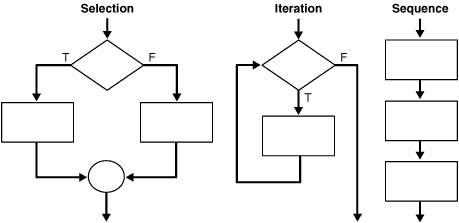
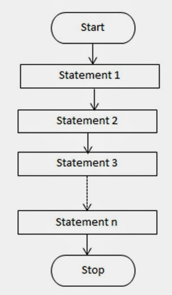
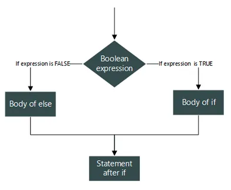
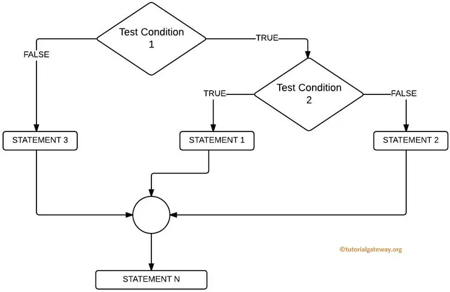

We can combine boolean expressions with control statements to specify how programs will complete a task. Control statments allow you to have flexible outcomes by selecting which pieces of codes are executed, or not. 

The three primary types of [control statements][controlStructures] are: 
- Sequential statmenetes are executed in the default ordering
- Iterative statements control the number of times a block of code is executed
- Conditional (or selection) statements control which blocks of code are executed, and which are not

{: width="500" }
*[Image source][controlStructures]*

The most common type of control structure are [sequential statements][seqStatements]. These are indicated by code statements written one after another, are are executed line by line. This means that the statements are performed in a top to bottom sequence according to how they are written.

{: width="500" }
*[Image source][seqStatements]*

> ## Challenge - Sequential Statements
>
> What does the following sequential statment output?
>
> **Pseudocode:**
> 1. 
>
>> ## Code Examples
>> ~~~
>> 
>> ~~~
>> {: .language-r}
>>
>> ~~~
>> 
>> ~~~
>> {: .language-bash}
> {: .solution}
>
>> ## Solution
>>
>> ~~~
>> 
>> ~~~
>> {: .output}
> {: .solution}
{: .challenge}

Iterative statements allow you to execute the same piece of code a specified number of times, or until a condition is reached. The most common [iterative statements][loopStatements] are defined using either FOR or WHILE loops. Let's start by looking at a flow diagram for a FOR loop, which dipicts the flow of information from inputs to outputs.

{: width="500" }
*[Image source][loopsInR]*

> ## Challenge - Iterative Statements 1
>
> What does the following FOR loop output?
>
> **Pseudocode:**
> 1. For each value in the sequence 1, 2, 3, 4, 5 
> - Assign x the current value
> - print the value of x
>
>> ## Code Examples
>> ~~~
>> for (x in 1:5) {
>>   print(x)
>> }
>> ~~~
>> {: .language-r}
>>
>> ~~~
>> for x in {1..5}
>> do
>>   echo $x
>> done
>> ~~~
>> {: .language-bash}
> {: .solution}
>
>> ## Solution
>>
>> The FOR loop outputs the current value of x at each iteration:
>> ~~~
>> 1
>> 2
>> 3
>> 4
>> 5
>> ~~~
>> {: .output}
> {: .solution}
{: .challenge}

WHILE loops are another type of iterative statement that can be used as a control structure in your code. This type of iterative statement will continue to execute a piece of code until a condition is reached.

{: width="500" }
*[Image source][loopsInR]*

> ## Challenge - Iterative Statements 2
>
> What does the following WHILE loop output?
>
> **Pseudocode:**
> 1. Assign x the value of 1
> 2. While x is less than 3 
> - print the value of x
> - increment the value of x by 1
>
>> ## Code Examples
>> ~~~
>> x <- 1
>> while (x < 3) {
>>   print(x)
>>   x <- i + 1
>> }
>> ~~~
>> {: .language-r}
>>
>> ~~~
>> x=1
>> while [ $x -lt 3 ]
>> do
>>   echo $x
>> done
>> ~~~
>> {: .language-bash}
> {: .solution}
>
>> ## Solution
>>
>> The WHILE loop outputs the current value of x at each iteration:
>> ~~~
>> 1
>> 2
>> 3
>> ~~~
>> {: .output}
> {: .solution}
{: .challenge}

The most common [conditional statements][conditionalStatements] are defined using combinations of the IF... THEN format.

{: width="500" }
*[Image source][conditionalStatements]*

The most simple form of conditional statement is the IF... THEN form.

{: width="500" }
*[Image source][ifThenInPython]*

> ## Challenge - Conditional Statements 1
>
> What does the following IF... THEN conditional statement output?
>
> **Pseudocode:**
> 1. Assign x the value of 7
> 2. If x is greater than 6, then print the value of x
>
>> ## Code Examples
>> ~~~
>> x <- 7
>> if (x > 6) {
>>   print(x)
>> }
>> ~~~
>> {: .language-r}
>>
>> ~~~
>> x=7
>> if [ $x -gt 6 ]
>> then
>>   echo $x
>> fi
>> ~~~
>> {: .language-bash}
> {: .solution}
>
>> ## Solution
>>
>> The IF... THEN statement outputs the value of x if it is greater than 6:
>> ~~~
>> 7
>> ~~~
>> {: .output}
> {: .solution}
{: .challenge}

The next type of conditional statement adds a level of complexity with the IF... THEN... ELSE format.

{: width="500" }
*[Image source][ifElseInR]*

> ## Challenge - Conditional Statements 2
>
> What does the following IF... THEN... ELSE conditional statement output?
>
> **Pseudocode:**
> 1. Assign x the value of 7
> 2. If x is less than 6, then print the value of x
> 3. Else print "x is greater than or equal to 6"
>
>> ## Code Examples
>> ~~~
>> x <- 7
>> if (x < 6) {
>>   print(x)
>> } else {
>> 	print("x is greater than or equal to 6")
>> }
>> ~~~
>> {: .language-r}
>>
>> ~~~
>> x=7
>> if [ $x -lt 6 ]
>> then
>>   echo $x
>> else
>>   echo "x is greater than or equal to 6"
>> fi
>> ~~~
>> {: .language-bash}
> {: .solution}
>
>> ## Solution
>>
>> The IF... THEN... ELSE statement outputs the value of x if it is less than 6, else it prints a message:
>> ~~~
>> x is greater than or equal to 6
>> ~~~
>> {: .output}
> {: .solution}
{: .challenge}

A more advanced type of conditional statement combines multiple IF... THEN... ELSE statements to make a compound statememnt with many alternative outcomes.

{: width="500" }
*[Image source][ifElseInR]*

> ## Challenge - Conditional Statements 3
>
> What does the following compound IF... THEN... ELSE conditional statement output?
>
> **Pseudocode:**
> 1. Assign x the value of 7
> 2. If x is equal to 6, then print "x is equal to 6"
> 3. Else if x is greater than 6, then print "x is greater than 6"
> 4. Else if x is less than 6, then print "x is less than 6"
>
>> ## Code Examples
>> ~~~
>> x <- 7
>> if (x = 6) {
>>   print("x is equal to 6")
>> } else if (x > 6) {
>> 	print("x is greater than 6")
>> } else if (x < 6) {
>> 	print("x is less than 6")
>> }
>> ~~~
>> {: .language-r}
>>
>> ~~~
>> x=7
>> if [ $x -eq 6 ]
>> then
>>   echo "x is equal to 6"
>> elif [ $x -gt 6 ]
>> then
>>   echo "x is greater than 6"
>> elif [ $x -lt 6 ]
>> then
>>   echo "x is less than 6"
>> fi
>> ~~~
>> {: .language-bash}
> {: .solution}
>
>> ## Solution
>>
>> The IF... THEN... ELSE statement outputs a message depending on if the value of x is equal to, greater than, or less than 6:
>> ~~~
>> x is greater than 6
>> ~~~
>> {: .output}
> {: .solution}
{: .challenge}

### Advanced Concept

An even more advanced concept, nested IF... THEN... ELSE statements can increase the flexability of your code by allowing you to specify more complex conditions.

{: width="500" }
*[Image source][nestedIfElseInR]*

> ## Advanced Challenge 1
> 
> If you are looking for an additional challenge, consider the following nested IF... THEN... ELSE statement:
>
> **Pseudocode:**
> 1. Assign x the value of 4
> 2. If x is greater than 4, then check if x is equal to 6
> - If x is equal to 6, then print "x is equal to 6"
> - Else print "x is greater than 4"
> 3. Else print "x is less than or equal to 4"
>
>> ## Code Examples
>> ~~~
>> x <- 4
>> if (x > 4) {
>>   if (x = 6) {
>>     print("x is equal to 6")
>>   } else {
>>     print("x is greater than 4")
>>   }
>> } else {
>>   print("x is less than or equal to 4")
>> }
>> ~~~
>> {: .language-r}
>>
>> ~~~
>> x=4
>> if [ $x -gt 4 ]
>> then
>>   if [ $x -eq 6 ]
>>   then
>>     echo "x is greater than 4"
>>   else
>>     echo "x is less than or equal to 4"
>>   fi
>> fi
>> ~~~
>> {: .language-bash}
> {: .solution}
>
>> ## Solution
>>
>> The nested IF... THEN... ELSE statement outputs the following message:
>> ~~~
>> x is less than or equal to 4
>> ~~~
>> {: .output}
> {: .solution}
{: .challenge}

> ## Advanced Challenge 2
>
> What are the outputs of the following sequential and nested conditional statements?
>
>
>
> What are the similarities and differences between these sequential and nested conditional statements?
>
> 
>
>> ## Solution
>>
>> 
> {: .solution}
{: .challenge}

[controlStructures]: https://docs.oracle.com/cd/B19306_01/appdev.102/b14261/controlstructures.htm
[seqStatements]: http://status-twitter.blogspot.com/2013/11/uses-of-sequential-and-compound.html
[loopStatements]: https://www.javatpoint.com/java-for-loop
[loopsInR]: https://www.geeksforgeeks.org/loops-in-r-for-while-repeat/
[ifThenInPython]: https://innovationyourself.com/conditional-statements-in-python/
[ifElseInR]: https://www.datasciencemadesimple.com/if-else-condition-r/
[nestedIfElseInR]: https://www.tutorialgateway.org/nested-if-else-in-r/


