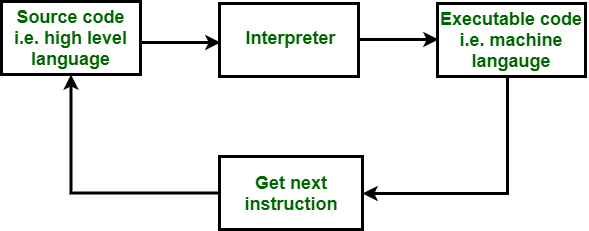
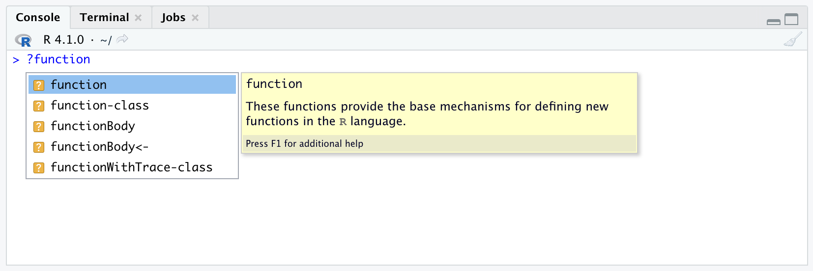
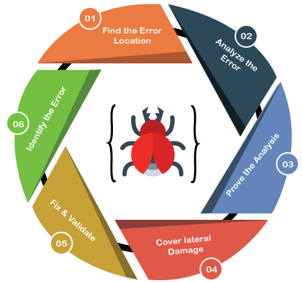

## Introduction to Scripting

Not only can we save the code we have written by using BASH and R scripts, but we can also use scripting to create modular pieces of code for use in data analysis. This is particularly helpful for automating repetative tasks in data analysis pipelines. 

It is also possible to have scripts recieve user inputs (arguments), just like the *built-in* and *user-defined* functions we have been using in R and BASH. This is great for making your code more generalizable and able to be run on a wider variety of data sets, or even allow users to specify file paths for data on different computer systems.

## R & BASH Scripting

We can use BASH scripting to make the process of coding with BASH a bit more simple. BASH scripts are text files that have the **.sh** file extension. These are text files that you can use to save the lines of BASH code that you want the interpreter componenet of the computer operating system to execute (run).

{: width="800" }
*[Image source][interpreterComp]*

There are several great text editors available for creating and editing code in a huge variety of programming languages. Just a few [popular options][popularEdits]:
- Sublime Text
- Atom
- Notepad++
- Vim

> ## Tip!
>
> There are s couple of extremely useful features of RStudio that are helpful for working with BASH:
> - the *source* component of RStudio is essentially a text editor that you can use RStudio to create and edit any type of text file
> - the *console* component has a *terminal* tab, which gives you access to the BASH *command line*
{: .callout}

## R & BASH Function Definitions

A powerful benefit of coding in BASH and R is the ability to create our own *user-defined* function definitions. This allows us to re-use a set of code statements arranged to perform a specific task. 

In R a function is created (defined) by using the keyword **function**. The basic syntax of an R function definition is as follows:

~~~
function_name <- function(arg_1, arg_2, ...) {
   # function body 
}
~~~
{: .language-r}

It is also possible to create user-defined functions in BASH using the following syntax:
~~~
function_name () {
  # function body
}
~~~
{: .language-r}

> ## Checklist
>
> Note that a function definition in R has the following components:
> - **function name** − the name of the function, which is stored in R environment as an R object with this name
> - **function keyword** - this is the tag word *function* that is always included before the parentheses with the list of arguments
> - **arguments** − an optional placeholder for when a function is called (invoked). If a function has arguments and they do not have default values, you need to give (pass) values to the arguments
> - **function body** − contains a collection of code statements that defines what the function does
> - **return value** − the last expression evaluated in the function body
>
> Furthermore, the simplest form of function definitions in BASH have the following components:
> - **function name** − the name of the function, which is stored in R environment as an R object with this name
> - **function body** − contains a collection of code statements that defines what the function does
{: .checklist}

> ## Challenge
>
> How can you view the documentation for the **function** R function in RStudio?
>
>> ## Solution
>> 
>> While typing in **?function** a message will pop up suggesting relevant R functions. While hovering your mouse over the **function** R function in the pop up, press F1.
>> 
>> {: width="800" }
> {: .solution}
{: .challenge}

Let's practice making our own *user-defined* functions in both the R and BASH languages. As a first step, we will make some functions with out arguments.

~~~
# definition of a function named my_function
my_function <- function() {
  print("hello")
  print("yellow")
}

# run the function by calling it by its name
my_function()
~~~
{: .language-r}

~~~
#!/bin/bash

# definition of a function named my_function
my_function () {
  echo "hello"
  echo "yellow"
}

# run the function by calling it by its name
my_function
~~~
{: .language-bash}

> ## Tip!
>
> Notice that the first line of the above BASH script is the following code:
>
> ~~~
> #!/bin/bash
> ~~~
> {: .language-bash}
>
> This piece of code is [called the *shebang*][shebangBASH], and it is always included as the first line of a BASH script. The *shebang* is a specific sequence of symbols and characters that is used to tell the operating system to use the BASH interpreter to execute the code in the rest of the file line-by-line (parse).
{: .callout}

> ## Coding Challenge
>
> What is the primary difference between the following definitions of **my_function** and **my_better_function**, and why is it important?
>
> ~~~
> # definition of a function named my_function,
> # which assigns values to two variables and adds them
> my_function <- function() {
> 	first_val <- 2
> 	second_val <- 4
> 	result <- first_val + second_val
> }
> 
> # run the function by calling it by its name
> my_function()
> 
> # function with an extra final line of code added to the function body
> my_better_function <- function() {
> 	first_val <- 2
> 	second_val <- 4
> 	result <- first_val + second_val
> 	result
> }
> 
> # run the function by calling it by its name
> my_better_function()
> ~~~
> {: .language-r}
{: .challenge}

Next, let's make some functions that require the input of arguments when they are run (callled).

> ## Tip!
>
> Note that you can use the **$(())** symbols as a shorthand way to perform [arithmetic expansion][mathBASH] in the BASH language, allows you to easily evaluate mathematical expressions. 
{: .callout}

~~~
# function to add two variables using arguments
my_add_function <- function(first_arg, second_arg) {
	first_val <- first_arg
	second_val <- second_arg
	result <- first_val + second_val
	result
}

# run the function by calling it by its name
# THIS WILL result IN AN ERROR
my_add_function()

# run the function by passing the function call the necessary arguments
my_add_function(2, 4)

# function to add two variables using default arguments
my_default_add_function <- function(first_arg = 100, second_arg = -100) {
	first_val <- first_arg
	second_val <- second_arg
	result <- first_val + second_val
	result
}

# run the function by calling it by its name
my_default_add_function()

# run the function by passing the function call the necessary arguments
my_default_add_function(2, 4)
~~~
{: .language-r}

~~~
#!/bin/bash

# function to add two variables using arguments
my_add_function () {
	first_val=$1
	second_val=$2
	result=$((first_val + second_val))
	echo $result
}

# run the function by calling it by its name
# THIS WILL result IN AN ERROR
my_add_function

# run the function by passing the function call the necessary arguments
my_add_function 2 4

# function to add two variables using default arguments
my_default_add_function () {
	first_val=${1:-100}
	second_val=${2:--100}
	result=$((first_val + second_val))
	echo $result
}

# run the function by calling it by its name
my_default_add_function

# run the function by passing the function call the necessary arguments
my_default_add_function 2 4
~~~
{: .language-bash}

### The Scope of R and BASH Variables

Now let's try an interesting example that illustrates the differences between the [*scope* of variables][scopeVars] in the R and BASH environments.

~~~
# assign values to environment variables
var1 <- "A"
var2 <- "B"

# declare a R function
my_function <- function() {
  # assign values to function variables
  var1 <- "C"
  var2  <- "D"
  # concatenate and print strings with the values of the variables inside the function
  cat("Inside my_function: var1:", var1, ", var2:", var2, "\n")
}

# concatenate and print strings with the values of the variables before the function is run
cat("Before running my_function: var1:", var1, ", var2:", var2, "\n")

# call the function
my_function()

# concatenate and print strings with the values of the variables after the function is run
cat("After running my_function: var1:", var1, ", var2:", var2, "\n")
~~~
{: .language-r}

~~~
#!/bin/bash

# assign values to environment variables
var1='A'
var2='B'

# declare a BASH function
my_function () {
  # assign values to function variables
  local var1='C'
  var2='D'
  # print strings with the values of the variables before the function is run
  echo "Inside my_function: var1: $var1, var2: $var2"
}

# print strings with the values of the variables before the function is run
echo "Before running my_function: var1: $var1, var2: $var2"

# call the function
my_function

# print strings with the values of the variables before the function is run
echo "After running my_function: var1: $var1, var2: $var2"
~~~
{: .language-bash}

> ## Discussion
>
> Because specific combinations of words and symbols have different meanings (syntax), the formatting of a *user-defined* function in R typically has several common features. What are some of these formatting features?
> 
>> ## Solution
>> 
>> Some of the typical formatting features of a R function include:
>> - assignment operator **<-**
>> - **function** tag word
>> - parentheses
>> - curly braces
>> - commas between any arguments
>> - indentation of function body
> {: .solution}
>
> What about BASH *user-defined* function definition formatting?
> 
>> ## Solution
>> 
>> Some of the typical formatting features of a BASH function include:
>> - parentheses
>> - curly braces
>> - indentation of function body
> {: .solution}
>
> It is also important to note that how functions are called, and so the format of the commands is significantly different between the R and BASH languages. What are these differences?
>
>> ## Solution
>> 
>> The main differences between R and BASH commands are:
>> - parentheses
>> - argument delimiter (comma vs space)
> {: .solution}
{: .discussion}

> ## Coding Challenge
> 
> Now write and run your own *user-defined* R and BASH functions using scripts! Try using some of the other *built-in* functions we have learned about so far in the body of the function you create. 
> 
> **Hint:** Remember that in R the last line of the function body is what gets returned when the function is executed (run). Also, there are several formatting differences between R and BASH function defitions and calling (commands).
{: .challenge}

### Using BASH Scripts to Run R Scripts

A powerful benefit of BASH scripting is the abiliy to run other scripts called within the **.sh** file. 

For example, let's create a simple test R script named *my_RScript.r* with the following code contents:

~~~
# print a message to the screen
print("Hello from my_RScript.r script!")
~~~
{: .landuage-r}

Now we can use the following BASH script to execute the R script we just made. We'll name this BASH script file *my_BASHScript_first.sh*.

~~~
#!/bin/bash

# run my_RScript.r script
Rscript my_RScript.r

# print a message to the screen
echo "Hello from my_BASHScript_first.sh script!"
~~~
{: .landuage-bash}

We can also use a different BASH script to run our previous BASH script. We'll name this BASH script file *my_BASHScript_last.sh*.

~~~
#!/bin/bash

# run my_BASHScript_first.sh script
bash my_BASHScript_first.sh

# print a message to the screen
echo "Hello from my_BASHScript_last.sh script!"
~~~
{: .landuage-bash}

## How to Find and Fix Bugs

While writting code it is very common to encounter errors that prevent your code from running (executing) in the expected manner. These errors are often the result of bugs, or flaws in your code.

{: width="500" }
*[Image source][codingProblems]*

The first step anytime you are trying to solve an error is to find the bug, which is the source of the error. To see an error in action, let's try to define a function that uses incompatible data types to perform a mathematical operation.

~~~
# definition of a funtion to add incompatible data type
my_function <- function() {
	first_val <- 2
	second_val <- "4"
	result <- first_val + second_val
	result
}

# run the function by calling it by its name
my_function()
~~~
{: .language-r}

This results in the following message to be output (returned) to the screen (console):

~~~
Error in first_val + second_val : non-numeric argument to binary operator
~~~
{: .error}

But from this message we cannot tell exactly which argument has the problem *non-numeric* value. Let's use the **print** function to find the exact source of the error.

~~~
# definition of a funtion to add incompatible data type
my_function <- function(first_arg, second_arg) {
	first_val <- first_arg
	second_val <- second_arg
	# added print statement to look at the value of each argument
	print(first_val)
	print(second_val)
	result <- first_val + second_val
	result
}

# run the function with an intentional error
my_function(2, "4")
~~~
{: .language-r}

So, it is important to take error meesages with a grain of salt. Instead of worrying or feeling overwhelemed when you recieve a bunch of incoherent error messages, tackle the problems one at a time and step-by-step. 

> ## Coding Challenge
>
> What is another function we can use to find the exact source of the error?
>
> **Hint:** Use the internet to search "r view data type", for example.
>
>> ## Solution
>>
>> ~~~
>> # definition of a funtion to add incompatible data type
>> my_function <- function(first_arg, second_arg) {
>>	first_val <- first_arg
>>	second_val <- second_arg
>>	# added print statement to look at the value of each argument
>>	typeof(first_val)
>>	typeof(second_val)
>>	result <- first_val + second_val
>>	result
>> }
>>
>> # run the function with an intentional error
>> my_function(2, "4")
>> ~~~
>> {: .language-r}
> {: .solution}
{: .challenge}

It is crucial to look for the first bug in your code when you are trying to find the source of an error. In general, you need to look for bugs starting at the top and work your way to the bottom of your code.

> ## Discussion
>
> Why is it so important to look for the earliest bug that appears in your code to fix first?
{: .discussion}

## Extending Logic & Control Statements to BASH

Recall that we can combine boolean expressions with control statements to specify how programs will complete a task. Control statments allow you to have flexible outcomes by selecting which pieces of codes are executed, or not. 

The three primary types of [control statements][controlStructures] are: 
- Sequential statmenetes are executed in the default ordering
- Iterative statements control the number of times a block of code is executed
- Conditional (or selection) statements control which blocks of code are executed, and which are not

The most common control structure of [sequential statements][seqStatements] are lines of code written one after another, and executed line by line.

> ## Coding Challenge - Sequential Statements
>
> Write BASH code for the following sequential statments:
>
> **Pseudocode**
> 1. Assign x the value of 6
> 2. Print the value of x
> 
>> ## Hint!
>>
>> ~~~
>> x <- 6
>> print(x)
>> ~~~
>> {: .language-r}
> {: .solution}
>
>> ## Solution
>> ~~~
>> #!/bin/bash
>> 
>> x=6
>> echo x
>> ~~~
>> {: .language-bash}
>>
>> ~~~
>> 6
>> ~~~
>> {: .output}
> {: .solution}
{: .challenge}

Iterative statements allow you to execute the same piece of code a specified number of times, or until a condition is reached. The most common [iterative statements][loopStatements] are defined using either FOR or WHILE loops. Let's start by looking at a flow diagram for a FOR loop, which dipicts the flow of information from inputs to outputs.

> ## Coding Challenge - Iterative Statements Part 1
>
> Write BASH code for the following FOR loop output:
>
> **Pseudocode**
> 1. For each value in the sequence 1, 2, 3, 4, 5 
> - Assign x the current value
> - print the value of x
>
>> ## Hint!
>>
>> ~~~
>> for (x in 1:5) {
>>   print(x)
>> }
>> ~~~
>> {: .language-r}
> {: .solution}
>
>> ## Solution
>>
>> ~~~
>> #!/bin/bash
>> 
>> for x in {1..5}
>> do
>>   echo $x
>> done
>> ~~~
>> {: .language-bash}
>>
>> ~~~
>> 1
>> 2
>> 3
>> 4
>> 5
>> ~~~
>> {: .output}
> {: .solution}
{: .challenge}

WHILE loops are another type of iterative statement that can be used as a control structure in your code. This type of iterative statement will continue to execute a piece of code until a condition is reached.

> ## Coding Challenge - Iterative Statements Part 2
>
> Write BASH code for the following WHILE loop output:
>
> **Pseudocode**
> 1. Assign x the value of 1
> 2. While x is less than 3 
> - print the value of x
> - increment the value of x by 1
>
>> ## Hint!
>>
>> ~~~
>> x <- 1
>> while (x < 3) {
>>   print(x)
>>   x <- x + 1
>> }
>> ~~~
>> {: .language-r}
> {: .solution}
>
>> ## Solution
>>
>> ~~~
>> #!/bin/bash
>> 
>> x=1
>> while [ $x -lt 3 ]
>> do
>>   echo $x
>> done
>> ~~~
>> {: .language-bash}
>>
>> ~~~
>> 1
>> 2
>> 3
>> ~~~
>> {: .output}
> {: .solution}
{: .challenge}

The most common [conditional statements][conditionalStatements] are defined using combinations of the IF... THEN format.

The most simple form of conditional statement is the IF... THEN form.

> ## Coding Challenge - Conditional Statements Part 1
>
> Write BASH code for the following IF... THEN conditional statement output:
>
> **Pseudocode**
> 1. Assign x the value of 7
> 2. If x is greater than 6, then print the value of x
>
>> ## Hint!
>>
>> ~~~
>> x <- 7
>> if (x > 6) {
>>   print(x)
>> }
>> ~~~
>> {: .language-r}
> {: .solution}
>
>> ## Solution
>>
>> ~~~
>> #!/bin/bash
>> 
>> x=7
>> if [ $x -gt 6 ]
>> then
>>   echo $x
>> fi
>> ~~~
>> {: .language-bash}
>>
>> ~~~
>> 7
>> ~~~
>> {: .output}
> {: .solution}
{: .challenge}

The next type of conditional statement adds a level of complexity with the IF... THEN... ELSE format.

> ## Coding Challenge - Conditional Statements Part 2
>
> Write BASH code for the following IF... THEN... ELSE conditional statement output:
>
> **Pseudocode**
> 1. Assign x the value of 7
> 2. If x is less than 6, then print the value of x
> 3. Else print "x is greater than or equal to 6"
>
>> ## Hint!
>>
>> ~~~
>> x <- 7
>> if (x < 6) {
>>   print(x)
>> } else {
>> 	print("x is greater than or equal to 6")
>> }
>> ~~~
>> {: .language-r}
> {: .solution}
>
>> ## Solution
>>
>> ~~~
>> #!/bin/bash
>> 
>> x=7
>> if [ $x -lt 6 ]
>> then
>>   echo $x
>> else
>>   echo "x is greater than or equal to 6"
>> fi
>> ~~~
>> {: .language-bash}
>>
>> ~~~
>> x is greater than or equal to 6
>> ~~~
>> {: .output}
> {: .solution}
{: .challenge}

A more advanced type of conditional statement combines multiple IF... THEN... ELSE statements to make a compound statememnt with many alternative outcomes.

> ## Coding Challenge - Conditional Statements Part 3
>
> Write BASH code for the following compound IF... THEN... ELSE conditional statement output:
>
> **Pseudocode**
> 1. Assign x the value of 7
> 2. If x is equal to 6, then print "x is equal to 6"
> 3. Else if x is greater than 6, then print "x is greater than 6"
> 4. Else if x is less than 6, then print "x is less than 6"
>
>> ## Hint!
>>
>> ~~~
>> x <- 7
>> if (x = 6) {
>>   print("x is equal to 6")
>> } else if (x > 6) {
>> 	print("x is greater than 6")
>> } else if (x < 6) {
>> 	print("x is less than 6")
>> }
>> ~~~
>> {: .language-r}
> {: .solution}
>
>> ## Solution
>>
>> ~~~
>> #!/bin/bash
>> 
>> x=7
>> if [ $x -eq 6 ]
>> then
>>   echo "x is equal to 6"
>> elif [ $x -gt 6 ]
>> then
>>   echo "x is greater than 6"
>> elif [ $x -lt 6 ]
>> then
>>   echo "x is less than 6"
>> fi
>> ~~~
>> {: .language-bash}
>>
>> ~~~
>> x is greater than 6
>> ~~~
>> {: .output}
> {: .solution}
{: .challenge}

### Advanced Concept

An even more advanced concept, nested IF... THEN... ELSE statements can increase the flexability of your code by allowing you to specify more complex conditions.

> ## Advanced Challenge
> 
> If you are looking for an additional challenge, write BASH code for the following nested IF... THEN... ELSE statement:
>
> **Pseudocode**
> 1. Assign x the value of 4
> 2. If x is greater than 4, then check if x is equal to 6
> - If x is equal to 6, then print "x is equal to 6"
> - Else print "x is greater than 4"
> 3. Else print "x is less than or equal to 4"
>
>> ## Hint!
>>
>> ~~~
>> x <- 4
>> if (x > 4) {
>>   if (x = 6) {
>>     print("x is equal to 6")
>>   } else {
>>     print("x is greater than 4")
>>   }
>> } else {
>>   print("x is less than or equal to 4")
>> }
>> ~~~
>> {: .language-r}
> {: .solution}
>
>> ## Solution
>>
>> ~~~
>> #!/bin/bash
>> 
>> x=4
>> if [ $x -gt 4 ]
>> then
>>   if [ $x -eq 6 ]
>>   then
>>     echo "x is greater than 4"
>>   else
>>     echo "x is less than or equal to 4"
>>   fi
>> fi
>> ~~~
>> {: .language-bash}
>>
>> ~~~
>> x is less than or equal to 4
>> ~~~
>> {: .output}
> {: .solution}
{: .challenge}

[interpreterComp]: https://www.geeksforgeeks.org/difference-between-assembler-and-interpreter/ 
[popularEdits]: https://kinsta.com/blog/best-text-editors/
[codingProblems]: https://www.geeksforgeeks.org/how-to-approach-a-coding-problem/
[mathBASH]: https://www.shell-tips.com/bash/math-arithmetic-calculation/
[scopeVars]: https://linuxize.com/post/bash-functions/
[shebangBASH]: https://linuxize.com/post/bash-shebang/
[conditionalStatements]: https://code.org/curriculum/course2/12/Teacher
[controlStructures]: https://docs.oracle.com/cd/B19306_01/appdev.102/b14261/controlstructures.htm
[seqStatements]: http://status-twitter.blogspot.com/2013/11/uses-of-sequential-and-compound.html
[loopStatements]: https://www.javatpoint.com/java-for-loop


