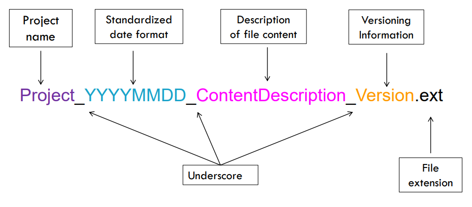

## The Importance of Formatting

It is important to [format your code][carefulFormatting] in a manner that is conducive to reading. While some coding languages have specific formatting requirements, formatting and commenting code is typically not actually needed for a program to work. Code should always be written in a consistent and logical format so that not only you, but others can read your program and quickly understand the purpose of your program. This is easy to achieve by setting and following a few simple rules.

{: width="800" }
*[Image source][carefulFormatting]*

> ## Checklist
>
> By following common formatting conventions, you can begin writting executable code in most programming languages. 
> 
> Many formatting rules are centered on the following:
> - Syntax
> - Indentation
> - White space
> - Capitalization
> - Naming conventions
> - Spelling of words (e.g., functions and variables)
> - Comments
{: .checklist}

The exact details of the formatting conventions your need to follow depends on the programming language in which you are writting your code.

## Programming Language Conventions 

There is a set of guildlines for every programming language that informs how code should be formatted and the meaning behind specific combinations of words and symbols. Recall that the exact details of the formatting conventions your need to follow depends on the programming language in which you are writting your code.

> ## Discussion
>
> Which is better to use when there are multiple words in a variable name?
> - underscores (e.g., my_value)
> - capatalization (e.g., myValue)
{: .discussion}

### Naming Conventions

As we know, consistent file naming is important for properly managing your data. Some common file naming conventions:
- file names should be meaningful and end in an appropriate extension
- if files need to be run in sequence, prefix them with numbers

Using common naming conventions is also a good way to improve the readability of your code. This is important since it enables yourself and others to more readily understand the purpose of your code. 

{: width="800" }
*[Image source][fileConventions]*

> ## Checklist
>
> One of the best practices of programming is to consistently follow a convention when naming files, variables, functions, and anything else.
>
> Some common [R naming conventions][conventionsR]:
> - variable and function names should be lowercase
> - use an underscore or capatalization (camel case) to separate words within a name
> - generally, variable names should be nouns and function names should be verbs
> - strive for names that are concise and meaningful
> - where possible, avoid using names of existing functions and variables
>
> And some common [BASH naming conventions][conventionsBASH]:
> - function names should be lower-case, with underscores to separate words
> - anything exported to the environment (e.g., constants) should be capitalized, separated with underscores, declared at the top of the file
> - source filenames should be lowercase, with underscores to separate words if desired
> - you can use readonly or declare -r to ensure that specific variables are *read only*
> - declare function-specific variables using the **local** keyword, and with the declaration and assignment on different lines
{: .checklist}

### Formatting Conventions

We now know that specific combinations of words and symbols have differfent meanings depending on the programming language. But did you also know that the formatting of the words and symbols can be important as well?

> ## Checklist
>
> The syntax of the R programming language has several components, some of these include:
> **Spacing**
> - Place spaces around all infix operators (e.g., =, +, -, <-)
> - Place spaces around = in function calls
> - Always put a space after a comma, and never before. Exceptions to this rule: :, :: and ::: don’t need spaces around them
> - Place a space before left parentheses, except in a function call
> - More than one space in a row is ok if it improves alignment of equal signs or assignments (<-)
> - Do not place spaces around code in parentheses or square brackets, unless there is a comma
>
> **Curly Braces**
> - An opening curly brace should never go on its own line and should always be followed by a new line
> - A closing curly brace should always go on its own line, unless it is followed by an **else**
> - Always indent the code inside curly braces
> - It is ok to leave very short statements on the same line
>
> **Line Length**
> - Strive to limit your code to 80 characters per line, which fits comfortably on a printed page with a reasonably sized font
> - If you find yourself running out of room, you should try to encapsulate and subdivide some of the work in a separate function
>
> **Indentation**
> - When indenting your code, use two spaces
> - Never use tabs or mix tabs and spaces, unless a function definition runs over multiple lines. In that case, indent the second line to where the definition starts
> 
> **Assignment**
> - Use <-, not =, for assignment
{: .checklist}

> ## Checklist
>
> The syntax of the BASH programming language has several components, some of these include:
> **Indentation**
> - Indent 2 spaces
> - No tabs
> - Use blank lines between blocks of code to improve readability
>
> **Line Length & Long Strings**
> - Maximum line length is 80 characters
>
> **Pipelines**
> - The entire pipeline of commands should be written on one line when possible
> - Commands be split one per line, if all the commands do not fit on one line
>
> **Loops**
> - Put **;** do and **;** then on the same line as the **while**, **for** or **if** keywords
> - **else** should be on its own line
> - Closing statements should be on their own line, and vertically aligned with the opening statement
>
> **Variable Expansion**
> - Quote your variables
> - Prefer the "${var}" over "$var" form, which is called [*brace-delimiting*][varExpand]
>
> **Quoting**
> - Always quote strings containing variables, command substitutions, spaces or shell meta characters
> - Use arrays for safe quoting of lists of elements, especially command line flags
> - Prefer quoting strings that are *words*, in contrast to command options or file path names
> - Never quote literal integers
> - Use "$@" unless you have a specific reason to use $\*
{: .checklist}

> ## Discussion
>
> What should you do if a file of code you are eiditing does not follow established, or common language conventions?
>
>> ## Solution
>>
>> Note that for existing files of code that you are editing, it is best to not modify the existing formatting.
> {: .solution}
{: .discussion}

[carefulFormatting]: https://coreassistance.com/tips/2018/02/13/be-careful-with-code-formatting/
[conventionsR]: http://adv-r.had.co.nz/Style.html
[conventionsBASH]: https://google.github.io/styleguide/shellguide.html
[fileConventions]: https://biblio.uottawa.ca/en/services/faculty/research-data-management/file-naming-and-organization-data
[varExpand]: https://google.github.io/styleguide/shellguide.html#s5.6-variable-expansion


